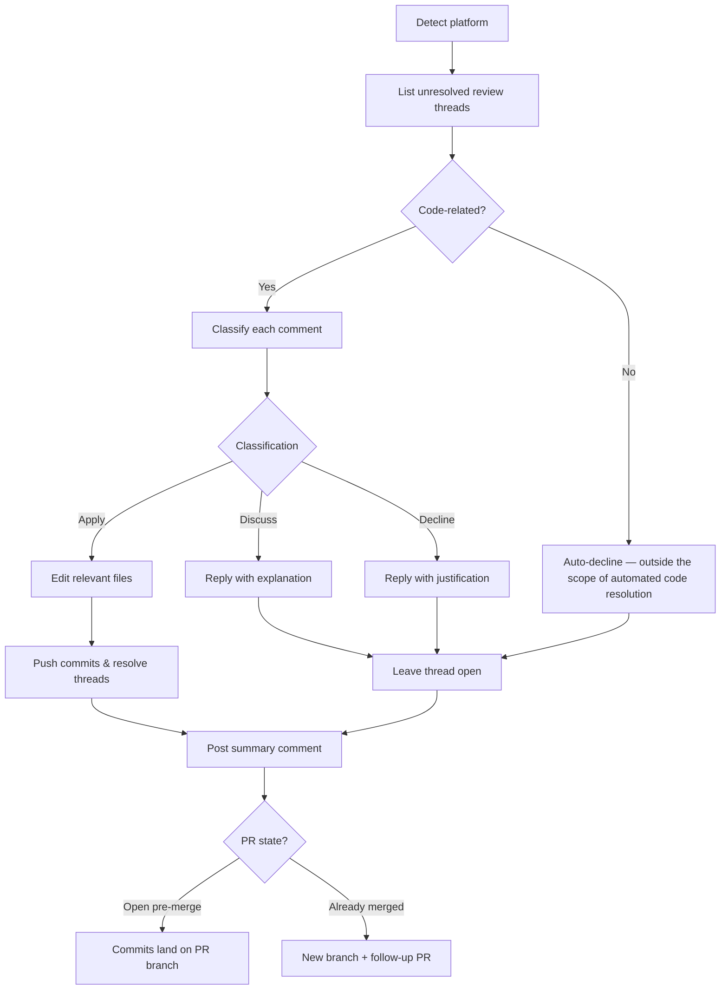

The **PR Comment Resolver** plugin reads every unresolved review thread on a pull request, classifies each comment, applies the actionable ones as commits, and posts a structured disposition report.

| Action | What it means |
|---|---|
| **Apply** | Clear, actionable change request — edits the relevant files and resolves the thread |
| **Discuss** | Needs human judgement — leaves the thread open with a short explanation |
| **Decline** | Out of scope, conflicts with another decision, or factually wrong — leaves the thread open with a short justification |

Works with **GitHub**, **Azure DevOps**, **Bitbucket**, and any generic git repository.

---

## How It Works



1. **Detect platform** — reads `git remote` to identify GitHub, Azure DevOps, Bitbucket, or generic.
2. **List threads** — fetches every unresolved review thread (top-level and inline) via the platform API.
3. **Filter** — each thread is checked for relevance; comments that do not request a code change (general discussion, process questions, praise) are auto-declined with the reply: *"This comment does not request a code change and is outside the scope of automated resolution."*
4. **Classify** — each remaining comment is assigned one of three dispositions: **apply**, **discuss**, or **decline**.
5. **Apply changes** — for every *apply* comment, the relevant files are edited in place.
6. **Push & resolve** — commits are pushed and the addressed threads are marked resolved on the platform.
7. **Reply to the rest** — *discuss* and *decline* threads each receive a short reply explaining why they were left open.
8. **Post summary** — a structured comment lists every thread and its final disposition.

When triggered **after a PR is already merged**, the plugin cuts a new branch from the merge commit, pushes the changes there, and opens a follow-up PR linked back to the original.

---

## Inputs

| Input | Source | Required | Description |
|---|---|---|---|
| Repository URL | Agent rule | Yes | The repository to resolve comments in — provided by the Xianix Agent rule, not typed in the prompt |
| PR number | Prompt | No | Target a specific pull request (e.g. `123`) |
| Branch name | Prompt | No | Override the branch to commit resolved changes to |

The platform (GitHub, Azure DevOps, etc.) is **auto-detected** from `git remote` — you don't need to specify it.

---

## Sample Prompts

**Resolve comments on the current PR:**

```text
/resolve-comments
```

**Resolve comments on a specific PR:**

```text
/resolve-comments 42
```

---

## Environment Variables

| Variable | Platform | Required | Purpose |
|---|---|---|---|
| `GITHUB_TOKEN` | GitHub | Yes | Authenticate `gh` CLI for fetching threads, posting replies, and pushing commits |
| `AZURE_DEVOPS_TOKEN` | Azure DevOps | Yes | PAT for REST API calls, thread management, and git push |

### GitHub Token Permissions

The `GITHUB_TOKEN` requires the following repository permissions:

| Permission | Access | Why it's needed |
|---|---|---|
| **Contents** | Read & Write | Read repository files, commit changes, and push to branches |
| **Metadata** | Read | Search repositories, list collaborators, and access repository metadata |
| **Pull requests** | Read & Write | Fetch review threads and comments, post replies, resolve threads, and open follow-up PRs |

---

## Quick Start

```bash
# Point Claude Code at the plugin
claude --plugin-dir /path/to/xianix-plugins-official/plugins/comment-resolver

# Then in the chat
/resolve-comments
```

Or trigger it automatically via the Xianix Agent by adding a rule — see the examples below and the [Rules Configuration](/agent-configuration/rules/) guide.

---

## Rule Examples

Add one (or both) of the execution blocks below to your `rules.json` so the Xianix Agent automatically resolves review comments when a webhook fires.

### When does the agent trigger?

The PR Comment Resolver is **tag-driven**. It runs when the `ai-dlc/pr/address-comments` label (GitHub) or tag (Azure DevOps) is present on a pull request and one of the following happens (OR logic across `match-any` entries):

| Scenario | What it covers |
|---|---|
| Tag newly applied to a PR | A human (or another rule) adds `ai-dlc/pr/address-comments` to an open PR |
| PR opened with the tag already present | A PR is created with the tag included from the start |

There is no push-based re-trigger by default. The label or tag is the single source of truth for "resolve comments on this PR."

| Platform | Scenario | Webhook event | Filter rule |
|---|---|---|---|
| GitHub | Tag newly applied | `pull_request` | `action==labeled` and the just-added `label.name=='ai-dlc/pr/address-comments'` |
| GitHub | PR opened with tag | `pull_request` | `action==opened` and `ai-dlc/pr/address-comments` is in `pull_request.labels` |
| Azure DevOps | Tag newly applied | `git.pullrequest.updated` | `message.text` contains `tagged the pull request` and `ai-dlc/pr/address-comments` is in `resource.labels` |
| Azure DevOps | PR created with tag | `git.pullrequest.created` | `ai-dlc/pr/address-comments` is in `resource.labels` |

### GitHub

```json
{
  "name": "github-pull-request-comment-resolver",
  "match-any": [
    {
      "name": "github-pr-tag-applied",
      "rule": "action==labeled&&label.name=='ai-dlc/pr/address-comments'"
    },
    {
      "name": "github-pr-opened-with-tag",
      "rule": "action==opened&&pull_request.labels.*.name=='ai-dlc/pr/address-comments'"
    }
  ],
  "use-inputs": [
    { "name": "pr-number",       "value": "number" },
    { "name": "repository-url",  "value": "repository.clone_url" },
    { "name": "repository-name", "value": "repository.full_name" },
    { "name": "pr-title",        "value": "pull_request.title" },
    { "name": "pr-head-branch",  "value": "pull_request.head.ref" },
    { "name": "platform",        "value": "github", "constant": true }
  ],
  "use-plugins": [
    {
      "plugin-name": "comment-resolver@xianix-plugins-official",
      "marketplace": "xianix-team/plugins-official"
    }
  ],
  "execute-prompt": "You are resolving review comments on pull request #{{pr-number}} titled \"{{pr-title}}\" in the repository {{repository-name}} (branch: {{pr-head-branch}}).\n\nRun /resolve-comments to classify and address the unresolved review threads. The `gh` CLI is authenticated and available if you need it directly."
}
```

### Azure DevOps

```json
{
  "name": "azuredevops-pull-request-comment-resolver",
  "match-any": [
    {
      "name": "azuredevops-pr-tag-applied",
      "rule": "eventType==git.pullrequest.updated&&message.text*='tagged the pull request'&&resource.labels.*.name=='ai-dlc/pr/address-comments'"
    },
    {
      "name": "azuredevops-pr-created-with-tag",
      "rule": "eventType==git.pullrequest.created&&resource.labels.*.name=='ai-dlc/pr/address-comments'"
    }
  ],
  "use-inputs": [
    { "name": "pr-number",       "value": "resource.pullRequestId" },
    { "name": "repository-url",  "value": "resource.repository.remoteUrl" },
    { "name": "repository-name", "value": "resource.repository.name" },
    { "name": "pr-title",        "value": "resource.title" },
    { "name": "pr-head-branch",  "value": "resource.sourceRefName" },
    { "name": "platform",        "value": "azuredevops", "constant": true }
  ],
  "use-plugins": [
    {
      "plugin-name": "comment-resolver@xianix-plugins-official",
      "marketplace": "xianix-team/plugins-official"
    }
  ],
  "execute-prompt": "You are resolving review comments on pull request #{{pr-number}} titled \"{{pr-title}}\" in the repository {{repository-name}} (branch: {{pr-head-branch}}).\n\nRun /resolve-comments to classify and address the unresolved review threads. The `az` CLI is authenticated and available if you need it directly."
}
```

:::note
These blocks go inside the `executions` array of a rule set. See [Rules Configuration](/agent-configuration/rules/) for the full file structure and filter syntax.
:::
