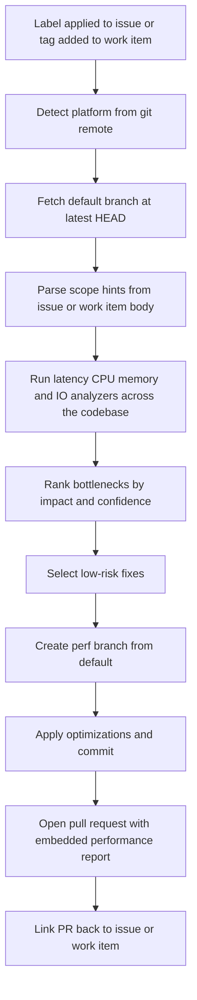

The **Performance Optimizer** performs a **whole-codebase** performance review against the repository's default branch and opens a pull request containing focused, low-risk optimizations together with an embedded performance report.

It is **issue-driven**: applying a single label to a GitHub issue (or tagging an Azure DevOps work item) launches the full flow — fetch default branch, analyze, fix, branch, PR, and link back to the originating issue.

Single trigger label: **`ai-dlc/perf/optimize`**

It focuses on:

| Capability | What it detects |
|---|---|
| **Latency Bottlenecks** | Slow request paths, expensive synchronous chains, high tail latency patterns |
| **CPU Hotspots** | Costly loops, repeated heavy computation, inefficient algorithms on critical paths |
| **Memory Pressure** | Excess allocations, retention-prone structures, avoidable object churn |
| **I/O and Query Inefficiencies** | N+1 queries, repeated remote calls, blocking I/O, missing batching/caching opportunities |

These capability categories follow common performance engineering practice; thresholds and prioritization are repository-specific and configurable.

Works with **GitHub** (issues) and **Azure DevOps** (work items). The underlying `/perf-optimize` command also runs locally against any git repository.

---

## How It Works



1. **Trigger detection** — webhook fires when `ai-dlc/perf/optimize` is applied to an issue (GitHub) or added as a tag on a work item (Azure DevOps).
2. **Detect platform** — reads `git remote` to confirm GitHub or Azure DevOps.
3. **Fetch default branch** — clones / checks out the latest commit on the repository's default branch. This is the analysis baseline, **not** a PR diff.
4. **Parse scope hints** — inspects the issue / work item body for optional `Scope:` and `Target:` hints; otherwise analyzes the whole codebase.
5. **Analyze bottlenecks** — evaluates latency, CPU, memory, and I/O patterns across the scoped paths.
6. **Prioritize impact** — ranks findings by expected performance gain, confidence, and blast radius.
7. **Apply scoped fixes** — commits selected low-risk optimizations to a new branch named `perf/issue-{number}-<slug>` (GitHub) or `perf/workitem-{id}-<slug>` (Azure DevOps).
8. **Open pull request** — PR title `perf: <issue title>`; PR body includes the full performance report and a `Closes #{number}` / work-item link reference.
9. **Link back** — posts a comment on the originating issue / work item pointing at the new PR.

This keeps the trigger lightweight (one label), moves review effort to the PR where teams already spend it, and still produces a human-readable report alongside actual code changes.

---

## Inputs

| Input | Source | Required | Description |
|---|---|---|---|
| Repository URL | Agent rule | Yes | The repository to analyze — provided by the Xianix Agent rule |
| Default branch | Repository metadata | Yes | Analysis baseline (auto-detected from the remote) |
| Issue number | GitHub webhook payload | Yes (GitHub) | The issue whose label triggered the run |
| Work item ID | Azure DevOps webhook payload | Yes (Azure DevOps) | The work item whose tag triggered the run |
| `ai-dlc/perf/optimize` | Issue label / work item tag | Yes | Single trigger for the full analyze-and-fix flow |
| Scope path | Issue / work item body | No | Restrict analysis to a directory or glob — e.g. `Scope: src/services` |
| Runtime target | Issue / work item body | No | Prioritize `api`, `worker`, `frontend`, or `data` — e.g. `Target: api` |

The platform is **auto-detected** from `git remote`. Scope hints are optional; if none are provided, the agent scans the whole codebase.

### Scope hint format

Add any of the following on their own line in the issue or work item body:

```text
Scope: src/services, src/workers
Target: api
```

Multiple comma-separated paths are supported. Paths are matched as globs relative to the repository root.

---

## Sample Prompts

The agent is primarily **webhook-driven** via issue labels. The `/perf-optimize` command can still be invoked locally when you run Claude Code directly.

**Scan the whole codebase on the default branch:**

```text
/perf-optimize
```

**Scan a specific directory:**

```text
/perf-optimize --scope src/services
```

**Scope to a runtime target:**

```text
/perf-optimize --target api
```

**Trigger via GitHub issue:** add the `ai-dlc/perf/optimize` label to the issue. The agent will:

1. Fetch the default branch at its latest commit.
2. Analyze the whole codebase (or the scope declared in the issue body).
3. Open a PR from `perf/issue-{N}-<slug>` containing focused optimizations and the performance report.
4. Comment on the issue linking to the new PR.

**Trigger via Azure DevOps work item:** add the `ai-dlc/perf/optimize` tag to the work item. The agent follows the same flow, creating a branch named `perf/workitem-{id}-<slug>` and a PR that references the work item.

---

## PR Output

Every run produces **one pull request** against the default branch. Its body contains:

- **Top bottlenecks** ranked by likely user impact
- **Latency risk areas** with estimated request-path effect
- **CPU and memory hotspots** with probable causes
- **I/O and query inefficiencies** with concrete rewrite suggestions
- **Optimization backlog** split into quick wins vs deeper follow-up
- **Per-change rationale** — why each commit matters, expected impact, validation hints
- **Traceability** — `Closes #{issue-number}` (GitHub) or work-item reference (Azure DevOps)

The agent only commits changes for findings it classifies as **low-risk quick wins**. Higher-risk or architectural suggestions are listed in the report's backlog section for human follow-up rather than auto-applied.

---

## Environment Variables

| Variable | Platform | Required | Purpose |
|---|---|---|---|
| `GITHUB_TOKEN` | GitHub | Yes | Authenticate `gh` CLI for issue reads, branch push, PR creation, and comment publishing |
| `AZURE_DEVOPS_TOKEN` | Azure DevOps | Yes | PAT for REST API calls against work items, code, and pull requests |

### GitHub Token Permissions

The `GITHUB_TOKEN` requires:

| Permission | Access | Why it's needed |
|---|---|---|
| **Contents** | Read & Write | Read repository code, push the new `perf/issue-*` branch |
| **Metadata** | Read | Resolve repository metadata (default branch, etc.) |
| **Issues** | Read & Write | Read the trigger issue body / scope hints and post a link-back comment |
| **Pull requests** | Read & Write | Open the optimization PR and update it with the report |

### Azure DevOps PAT Scopes

The `AZURE_DEVOPS_TOKEN` requires:

| Scope | Access | Why it's needed |
|---|---|---|
| **Code** | Read & Write | Read repository code, push the new `perf/workitem-*` branch |
| **Work Items** | Read & Write | Read the trigger work item body / scope hints and post a link-back comment |
| **Pull Request Threads** | Read & Write | Open the optimization PR and maintain its discussion thread |

---

## Quick Start

```bash
# Point Claude Code at the plugin
claude --plugin-dir /path/to/xianix-plugins-official/plugins/perf-optimizer

# Then in the chat
/perf-optimize
```

Or trigger it automatically via Xianix Agent rules by labeling a GitHub issue / tagging an Azure DevOps work item with `ai-dlc/perf/optimize`.

---

## Rule Examples

Use a single execution block per platform in your `rules.json`.

### Trigger behavior

The Performance Optimizer is **label-driven** with a single trigger:

| Platform | Scenario | Webhook event | Filter rule |
|---|---|---|---|
| GitHub | Label applied to issue | `issues` | `action==labeled` and `label.name=='ai-dlc/perf/optimize'` |
| GitHub | Issue opened with label already present | `issues` | `action==opened` and `ai-dlc/perf/optimize` is in `issue.labels` |
| Azure DevOps | Tag added to work item | `workitem.updated` | `resource.fields['System.Tags']` contains `ai-dlc/perf/optimize` |

### GitHub Rule

```json
{
  "name": "github-performance-optimizer",
  "match-any": [
    {
      "name": "github-issue-label-applied",
      "rule": "action==labeled&&label.name=='ai-dlc/perf/optimize'"
    },
    {
      "name": "github-issue-opened-with-label",
      "rule": "action==opened&&issue.labels.*.name=='ai-dlc/perf/optimize'"
    }
  ],
  "use-inputs": [
    { "name": "issue-number",     "value": "issue.number" },
    { "name": "issue-title",      "value": "issue.title" },
    { "name": "issue-body",       "value": "issue.body" },
    { "name": "repository-url",   "value": "repository.clone_url" },
    { "name": "repository-name",  "value": "repository.full_name" },
    { "name": "default-branch",   "value": "repository.default_branch" },
    { "name": "platform",         "value": "github", "constant": true }
  ],
  "use-plugins": [
    {
      "plugin-name": "perf-optimizer@xianix-plugins-official",
      "marketplace": "xianix-team/plugins-official"
    }
  ],
  "execute-prompt": "You are running a whole-codebase performance review for repository {{repository-name}} triggered by issue #{{issue-number}} titled \"{{issue-title}}\".\n\nFetch the default branch ({{default-branch}}), parse any `Scope:` / `Target:` hints from the issue body below, and run /perf-optimize across the selected scope (default: entire codebase).\n\nApply only low-risk optimizations on a new branch named `perf/issue-{{issue-number}}-<slug>` and open a pull request against {{default-branch}}. The PR body MUST embed the full performance report and include `Closes #{{issue-number}}`. After opening the PR, post a comment on issue #{{issue-number}} linking to it.\n\nIssue body:\n{{issue-body}}"
}
```

### Azure DevOps Rule

Because work items are project-scoped (not repo-scoped), the target repository URL must be configured on the rule itself rather than read from the event payload.

```json
{
  "name": "azuredevops-performance-optimizer",
  "match-any": [
    {
      "name": "azuredevops-workitem-tagged",
      "rule": "eventType==workitem.updated&&resource.fields.System.Tags*='ai-dlc/perf/optimize'"
    },
    {
      "name": "azuredevops-workitem-created-with-tag",
      "rule": "eventType==workitem.created&&resource.fields.System.Tags*='ai-dlc/perf/optimize'"
    }
  ],
  "use-inputs": [
    { "name": "workitem-id",     "value": "resource.id" },
    { "name": "workitem-title",  "value": "resource.fields.System.Title" },
    { "name": "workitem-body",   "value": "resource.fields.System.Description" },
    { "name": "repository-url",  "value": "https://dev.azure.com/<org>/<project>/_git/<repo>", "constant": true },
    { "name": "repository-name", "value": "<org>/<project>/<repo>", "constant": true },
    { "name": "default-branch",  "value": "main", "constant": true },
    { "name": "platform",        "value": "azuredevops", "constant": true }
  ],
  "use-plugins": [
    {
      "plugin-name": "perf-optimizer@xianix-plugins-official",
      "marketplace": "xianix-team/plugins-official"
    }
  ],
  "execute-prompt": "You are running a whole-codebase performance review for repository {{repository-name}} triggered by work item #{{workitem-id}} titled \"{{workitem-title}}\".\n\nFetch the default branch ({{default-branch}}), parse any `Scope:` / `Target:` hints from the work item description below, and run /perf-optimize across the selected scope (default: entire codebase).\n\nApply only low-risk optimizations on a new branch named `perf/workitem-{{workitem-id}}-<slug>` and open a pull request against {{default-branch}}. The PR body MUST embed the full performance report and reference work item #{{workitem-id}}. After opening the PR, post a comment on the work item linking to it.\n\nWork item description:\n{{workitem-body}}"
}
```

:::note
Replace the `<org>`, `<project>`, and `<repo>` placeholders in the Azure DevOps rule with your actual values. Deploy one rule per repository you want to cover.
:::

:::note
These blocks belong inside the `executions` array of a rule set. See [Rules Configuration](/agent-configuration/rules/) for full syntax.
:::

---

## Safety Invariants

The Performance Optimizer guarantees — enforced by both the orchestrator prompt and the `hooks/validate-prerequisites.sh` PreToolUse hook — that:

- **The default branch is never pushed to.** All changes go on a new `perf/issue-*` or `perf/workitem-*` branch.
- **Only Quick-win findings are ever applied automatically.** Architectural rewrites are surfaced as _Deeper follow-up_ in the embedded report, never auto-applied.
- **Every optimization commit is scoped and documented.** One commit per finding, prefixed `perf:`, with file + line reference.
- **The PR body always embeds the full performance report** so reviewers see analysis and code side by side.

---

## What's in this plugin

```
perf-optimizer/
├── .claude-plugin/
│   ├── plugin.json          # Manifest
│   ├── settings.json        # Default agent
│   └── .lsp.json            # Language servers (TypeScript, C#, Python, Go)
├── commands/
│   └── perf-optimize.md     # Slash command entry point
├── agents/
│   ├── orchestrator.md      # Whole-codebase controller
│   ├── latency-analyzer.md
│   ├── cpu-analyzer.md
│   ├── memory-analyzer.md
│   ├── io-query-analyzer.md
│   └── perf-pr-author.md    # Quick-win applier + PR opener
├── skills/
│   ├── analyze-performance/SKILL.md
│   └── create-perf-pr/SKILL.md
├── providers/
│   ├── github.md            # Issues + PRs via gh CLI
│   └── azure-devops.md      # Work items + PRs via REST
├── styles/
│   └── report-template.md
├── hooks/
│   ├── hooks.json
│   ├── validate-prerequisites.sh
│   └── notify-push.sh
├── docs/
│   ├── platform-setup.md
│   └── rules-examples.md
└── README.md
```

---

## License

MIT — same as the rest of this marketplace.
