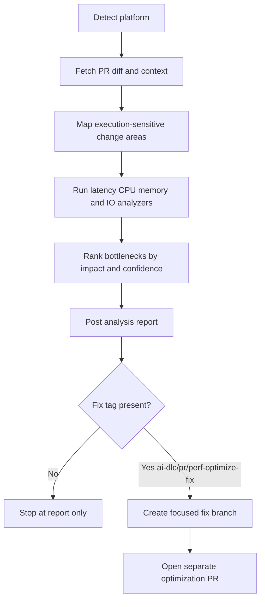

The **Performance Optimizer Agent** analyzes pull requests and branches to identify runtime bottlenecks before they impact users.

It uses a **developer-friendly two-phase model**:

1. **Analysis-first** (`ai-dlc/pr/perf-optimize`) — inspect performance risks and post findings.
2. **Opt-in fix PR** (`ai-dlc/pr/perf-optimize-fix`) — generate a separate optimization PR only when explicitly requested.

It focuses on:

| Capability | What it detects |
|---|---|
| **Latency Bottlenecks** | Slow request paths, expensive synchronous chains, high tail latency patterns |
| **CPU Hotspots** | Costly loops, repeated heavy computation, inefficient algorithms on critical paths |
| **Memory Pressure** | Excess allocations, retention-prone structures, avoidable object churn |
| **I/O and Query Inefficiencies** | N+1 queries, repeated remote calls, blocking I/O, missing batching/caching opportunities |

These capability categories follow common performance engineering practice; thresholds and prioritization are repository-specific and configurable.

Works with **GitHub**, **Azure DevOps**, **Bitbucket**, and any generic git repository.

---

## How It Works



1. **Detect platform** — reads `git remote` to identify GitHub, Azure DevOps, Bitbucket, or generic.
2. **Fetch context** — gathers changed files, recent commits, and probable runtime-critical code paths.
3. **Analyze bottlenecks** — evaluates latency, CPU, memory, and I/O patterns in touched code.
4. **Prioritize impact** — ranks findings by expected performance gain and user-visible effect.
5. **Recommend optimizations** — provides scoped, low-risk improvements and validation guidance.
6. **Publish report** — posts one consolidated result (or saves to `performance-report.md` on unsupported platforms).
7. **Optional fix PR** — if `ai-dlc/pr/perf-optimize-fix` is present, the agent creates a separate optimization PR.

This keeps normal review flow stable while still enabling automated performance improvements when teams opt in.

---

## Inputs

| Input | Source | Required | Description |
|---|---|---|---|
| Repository URL | Agent rule | Yes | The repository to analyze — provided by the Xianix Agent rule |
| PR number | Prompt | No | Analyze a specific pull request (e.g. `123`) |
| Branch name | Prompt | No | Analyze a branch against the default base |
| Scope path | Prompt | No | Restrict analysis to a directory or file pattern |
| Runtime target | Prompt | No | Prioritize API, worker, frontend, or data-layer paths |
| `ai-dlc/pr/perf-optimize` | PR label/tag | No | Trigger analysis-first report mode |
| `ai-dlc/pr/perf-optimize-fix` | PR label/tag | No | Trigger creation of a separate optimization fix PR |

The platform is **auto-detected** from `git remote`.

---

## Sample Prompts

**Analyze the current branch:**

```text
/perf-optimize
```

**Analyze a specific PR:**

```text
/perf-optimize 42
```

**Analyze backend services only:**

```text
/perf-optimize --scope src/services
```

**Analyze and apply safe optimizations:**

```text
/perf-optimize 42 --fix-pr
```

**Request a fix PR after analysis:**

```text
Add label/tag: ai-dlc/pr/perf-optimize-fix
```

---

## Report Output

The generated report includes:

- **Top bottlenecks** ranked by likely user impact
- **Latency risk areas** with estimated request-path effect
- **CPU and memory hotspots** with probable causes
- **I/O and query inefficiencies** with concrete rewrite suggestions
- **Optimization backlog** split into quick wins vs deeper follow-up

When fix mode is explicitly requested, the generated optimization PR includes:

- bottleneck summary and reason for change
- scoped code changes for selected low-risk items
- expected impact notes and verification checklist
- links to the source PR and analysis report

Each optimization recommendation includes:

- why the bottleneck matters
- expected performance impact
- suggested implementation boundary
- measurement and validation hints

See `styles/report-template.md` for the full report shape.

---

## Environment Variables

| Variable | Platform | Required | Purpose |
|---|---|---|---|
| `GITHUB_TOKEN` (or `GH_TOKEN`) | GitHub | Yes | Authenticate `gh` CLI for PR context, comment publishing, and fix-PR creation |
| `GIT_TOKEN` | GitHub / generic HTTPS | Fix-PR mode | Credential injection for `git push` of the `perf/optimize-*` branch |
| `AZURE_DEVOPS_TOKEN` | Azure DevOps | Yes | PAT for REST API calls, posting comments, and opening the optimization PR |

### GitHub Token Permissions

The `GITHUB_TOKEN` requires:

| Permission | Access | Why it's needed |
|---|---|---|
| **Contents** | Read | Read repository code, branches, and commit history |
| **Metadata** | Read | Resolve repository metadata |
| **Pull requests** | Read & Write | Fetch PR context, post performance findings, and open the optimization PR |

See `docs/platform-setup.md` for full setup instructions.

---

## Quick Start

```bash
# Point Claude Code at the plugin
claude --plugin-dir /path/to/xianix-plugins-official/plugins/performance-optimizer-agent

# Then in the chat
/perf-optimize
```

Or trigger it automatically via Xianix Agent rules — see `docs/rules-examples.md`.

---

## Rule Examples

Use two execution blocks in your `rules.json`:

- **Analysis rule** — runs on `ai-dlc/pr/perf-optimize`
- **Fix PR rule** — runs on `ai-dlc/pr/perf-optimize-fix`

Full JSON for GitHub and Azure DevOps lives in `docs/rules-examples.md`. Each block belongs inside the `executions` array of a rule set. See [Rules Configuration](/agent-configuration/rules/) for full syntax.

---

## Safety Invariants

The Performance Optimizer Agent guarantees — enforced by both the orchestrator prompt and the `hooks/validate-prerequisites.sh` PreToolUse hook — that:

- **Analysis-first mode never modifies code.** It posts a report, nothing more.
- **Fix-PR mode never pushes to the source PR branch.** All changes go on a new `perf/optimize-*` branch, with a separate PR targeting the source PR's base.
- **Only Quick-win findings are ever applied automatically.** Architectural rewrites are surfaced as _Deeper follow-up_ in the report, never auto-applied.
- **Every optimization commit is scoped and documented.** One commit per finding, prefixed `perf:`, with file + line reference.

---

## What's in this plugin

```
performance-optimizer-agent/
├── .claude-plugin/
│   ├── plugin.json          # Manifest
│   ├── settings.json        # Default agent
│   └── .lsp.json            # Language servers (TypeScript, C#, Python, Go)
├── commands/
│   └── perf-optimize.md     # Slash command entry point
├── agents/
│   ├── orchestrator.md      # Two-phase controller
│   ├── latency-analyzer.md
│   ├── cpu-analyzer.md
│   ├── memory-analyzer.md
│   ├── io-query-analyzer.md
│   └── fix-pr-author.md     # Quick-win applier + PR opener
├── skills/
│   ├── analyze-performance/SKILL.md
│   ├── create-fix-pr/SKILL.md
│   └── post-perf-report/SKILL.md
├── providers/
│   ├── github.md
│   ├── azure-devops.md
│   └── generic.md
├── styles/
│   └── report-template.md
├── hooks/
│   ├── hooks.json
│   ├── validate-prerequisites.sh
│   └── notify-push.sh
├── docs/
│   ├── platform-setup.md
│   └── rules-examples.md
└── README.md
```

---

## License

MIT — same as the rest of this marketplace.
