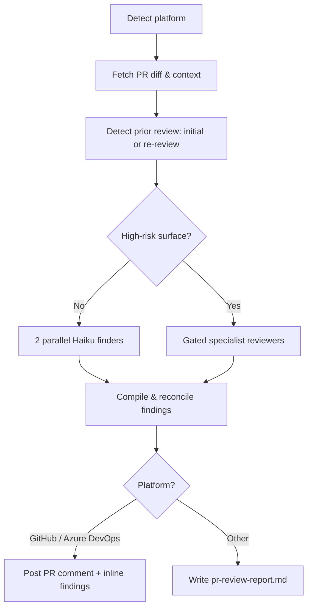

# PR Reviewer Claude Code Plugin

The **PR Reviewer** plugin runs a **cost-tiered** automated review and posts a unified, structured report directly on your pull request. Most PRs get a cheap two-pass scan; PRs that touch a high-risk surface (auth, payments, crypto, DB migrations, public APIs) automatically escalate to four specialized reviewers.

| Reviewer | What it looks for | Runs on |
|---|---|---|
| **Code Quality** | Architecture, patterns, readability, maintainability | Escalated path (always) |
| **Security** | Vulnerabilities, exposed secrets, insecure patterns (OWASP) | Escalated path (when in scope) |
| **Test Coverage** | Missing tests, quality gaps, untested code paths | Escalated path (when in scope) |
| **Performance** | Bottlenecks, algorithmic issues, resource waste | Escalated path (when in scope) |

On the default (non-escalated) path, two generic finder passes cover correctness/regressions and security/edge-cases instead — see [Review Tiers](#review-tiers) below.

Works with **GitHub**, **Azure DevOps**, and any generic git repository
---

## How It Works



1. **Detect platform** — reads `git remote` to identify GitHub, Azure DevOps, or generic.
2. **Fetch PR context & detect prior review** — gathers the diff, commit log, and changed file list against the base branch, and checks (via its own comment markers) whether this plugin already reviewed the PR.
3. **Choose a tier** — the diff is checked against a high-risk-surface heuristic to decide between the cheap default path and the escalated specialist path (see [Review Tiers](#review-tiers)).
4. **Run the review** — the selected reviewers run in parallel, then findings are verified, deduplicated, and reconciled against any prior review.
5. **Compile & post** — findings are merged into a single report with a computed verdict and posted as a PR comment with inline per-finding comments (or saved to `pr-review-report.md` for unsupported platforms).

With the `--fix` flag the plugin will also apply fixes (CRITICAL/WARNING only), commit, and push.

---

## Review Tiers

| Tier | When | What runs | Cost |
|---|---|---|---|
| **Default** | Ordinary PRs (the common case) | Two parallel Haiku finder passes — correctness/regressions and security/edge-cases — self-verified and capped at 8 findings | Low |
| **Escalated** | Diff touches a high-risk surface: auth/authz, payments/billing, crypto, DB migrations/schema, or public APIs | `code-reviewer` and `test-reviewer` (cheap quality tier) plus `security-reviewer` and `performance-reviewer` (frontier risk tier), gated individually by whether the diff is relevant to each | Higher, but only where it pays off |

The tier is chosen by **risk surface**, not diff size. Model selection on the escalated path can be tuned or pinned — see [Environment Variables](#environment-variables).

---

## Re-review Support

If the plugin has already reviewed a PR, a follow-up run (e.g. after new commits are pushed) automatically switches to **re-review mode**:

- Prior findings are reconciled — ones the author fixed are marked resolved, unresolved ones stay open without duplicate comments.
- The review focuses on the commits pushed since the last review.
- A re-review delta (fixed / carried-over / new counts) is posted instead of a full new wall of comments.

Set `PR_REVIEWER_RECONCILE=false` to force a stateless full review that ignores prior findings. This is GitHub/Azure DevOps only — the generic provider just regenerates the report file each run.

---

## Inputs

| Input | Source | Required | Description |
|---|---|---|---|
| Repository URL | Agent rule | Yes | The repository to review — provided by the Xianix Agent rule, not typed in the prompt |
| PR number | Prompt | No | Target a specific pull request (e.g. `123`) |
| Branch name | Prompt | No | Compare a branch against the default base |
| `--fix` flag | Prompt | No | Auto-fix CRITICAL/WARNING issues, commit, and push |
| `--push-update` flag | Prompt | No | Force re-review mode scoped to only the commits pushed since the last review (used by the agent's push-update rule blocks) |

The platform (GitHub, Azure DevOps, etc.) is **auto-detected** from `git remote` — you don't need to specify it.

---

## Sample Prompts

**Review the current branch:**

```text
/pr-review
```

**Review a specific PR:**

```text
/pr-review 42
```

**Review and auto-fix:**

```text
/pr-review 42 --fix
```

---

## Focused Single-Dimension Reviews

Besides the comprehensive `/pr-review`, the plugin ships standalone commands for a single dimension against the current branch (not posted to the PR — printed inline). These do **not** auto-trigger from the model's own judgment (`disable-model-invocation: true`) — they must be invoked explicitly.

| Command | Reviewer used |
|---|---|
| `/review-code [branch-name]` | `code-reviewer` — quality, readability, naming, duplication |
| `/review-security [branch-name]` | `security-reviewer` — OWASP, secrets, injection, auth |
| `/review-tests [branch-name]` | `test-reviewer` — coverage gaps, test quality |
| `/review-performance [branch-name]` | `performance-reviewer` — bottlenecks, N+1s, resource waste |
| `/review-pr [pr-number \| branch-name]` | Alias for the full `/pr-review` procedure |
| `/post-review [pr-number]` | Posts findings already compiled earlier in the conversation, using the same posting scripts as step 7 of `/pr-review` — for resuming a run whose posting step didn't complete |

---

## Environment Variables

The Xianix Agent reads these from its secrets store and injects them at runtime via the rule's `with-envs` block (see [Automated Triggering](#automated-triggering-xianix-agent) below). For local CLI use, export them in your shell.

| Variable | Platform | Required | Purpose |
|---|---|---|---|
| `GITHUB-TOKEN` | GitHub | Yes | Authenticate `gh` CLI for fetching PR data and posting comments |
| `AZURE-DEVOPS-TOKEN` | Azure DevOps | Yes | PAT for REST API calls and git push |

### Optional Tuning Variables

Not required to run the plugin — export these to change its default behavior. All are read from the shell environment, not the agent rule's `with-envs` block.

| Variable | Default | Purpose |
|---|---|---|
| `PR_REVIEWER_BLOCK_ON_CRITICAL` | `false` (advisory) | When `true`, a `REQUEST CHANGES` verdict posts as a **blocking** review (GitHub `--request-changes`, Azure DevOps vote `-10`) instead of the default non-blocking one (GitHub `--comment`, Azure DevOps vote `-5`) |
| `PR_REVIEWER_RECONCILE` | `true` | Set to `false` to force a stateless full review that ignores prior findings, disabling [re-review mode](#re-review-support) |
| `PR_REVIEWER_MODEL` | unset | Pins **every** reviewer sub-agent to one model (short slug: `sonnet`/`opus`/`haiku`/`fable`), ignoring the tiers below |
| `PR_REVIEWER_QUALITY_MODEL` | `haiku` | Model for the escalated path's quality-tier reviewers (`code-reviewer`, `test-reviewer`) |
| `PR_REVIEWER_RISK_MODEL` | lead's inherited model | Model for the escalated path's risk-tier reviewers (`security-reviewer`, `performance-reviewer`) |

The default (non-escalated) review path always uses `haiku` for its two finder passes, regardless of these variables.

### GitHub Token Permissions

The `GITHUB-TOKEN` requires the following repository permissions:

| Permission | Access | Why it's needed |
|---|---|---|
| **Contents** | Read | Access repository contents, commits, branches, downloads, releases, and merges |
| **Metadata** | Read | Search repositories, list collaborators, and access repository metadata |
| **Pull requests** | Read & Write | Fetch pull request diffs and context, post review comments, and access related assignees, labels, milestones, and merges |

### Azure DevOps Token Permissions

The `AZURE-DEVOPS-TOKEN` (Personal Access Token) requires:

| Permission | Access | Why it's needed |
|---|---|---|
| **Code** | Read & Write | Fetch PR diffs and metadata, push fix commits when `--fix` is used |
| **Pull Request Threads** | Read & Write | Post and edit the review comment / threads on the PR |

---

## Quick Start

```bash
# Point Claude Code at the plugin
claude --plugin-dir /path/to/xianix-plugins-official/plugins/pr-reviewer

# Then in the chat
/pr-review
```

Or trigger it automatically via the Xianix Agent by adding a rule — see [Automated Triggering](#automated-triggering-xianix-agent) below and the per-platform guides for [GitHub](./docs/triggers-github.md) and [Azure DevOps](./docs/triggers-azure-devops.md).

---

## Automated Triggering (Xianix Agent)

Add execution blocks to your `rules.json` so the Xianix Agent runs the plugin automatically when a webhook fires. The plugin uses **label-based** triggering on GitHub and **PR-lifecycle + reviewer-assignment + comment** triggering on Azure DevOps (Azure DevOps webhook payloads don't include label data).

Full, copy-pasteable execution blocks for every scenario live in dedicated per-platform guides:

- **[Automated Triggering — GitHub](./docs/triggers-github.md)** — PR opened with the review label, label applied, new commits pushed (PR update), and `@xianix` comment mentions.
- **[Automated Triggering — Azure DevOps](./docs/triggers-azure-devops.md)** — PR created, source branch updated (PR update), agent added as a reviewer, and `@xianix` comment mentions.

### Trigger matrix

| Platform | Scenario | Webhook event | Filter rule |
|---|---|---|---|
| GitHub | PR opened with review label | `pull_request` | `action==opened` and `ai-dlc/pr/pr-review` in `pull_request.labels` |
| GitHub | Label applied to a PR | `pull_request` | `action==labeled` and `label.name=='ai-dlc/pr/pr-review'` |
| GitHub | New commits to a labeled PR | `pull_request` | `action==synchronize` and `ai-dlc/pr/pr-review` in `pull_request.labels` |
| GitHub | `@xianix` comment on a PR | `issue_comment` | `action==created` and `comment.body` contains `@xianix` and `issue.pull_request?` |
| Azure DevOps | PR created | `git.pullrequest.created` | `resource.status=='active'` |
| Azure DevOps | New commits (source branch updated) | `git.pullrequest.updated` | `message.text` contains `updated the source branch` |
| Azure DevOps | Agent added as reviewer | `git.pullrequest.updated` | `message.text` contains `changed the reviewer list` and `xianix-agent@99x.io` in `resource.reviewers` |
| Azure DevOps | `@xianix` comment on a PR | `ms.vss-code.git-pullrequest-comment-event` | `resource.comment.commentType=='text'` and `resource.comment.content` contains `@xianix` |

The `GITHUB-TOKEN` / `AZURE-DEVOPS-TOKEN` secrets are injected via each block's `with-envs`. Re-review reconciliation across repeated events for the same PR is enabled by `conversation-key` (`pull_request.number` on GitHub, `resource.pullRequestId` on Azure DevOps). See the per-platform guides for the details.

:::note
These blocks go inside the `executions` array of a rule set. See [Rules Configuration](/agent-configuration/rules/) for the full file structure and filter syntax.
:::
