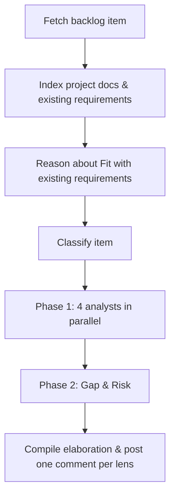

# Requirement Analyst Plugin

> An AI **thinking partner** for backlog refinement. Surrounds an issue or work item with the context a senior analyst would bring to a refinement session — fit with existing requirements, domain knowledge, competitive insight, user journeys, persona impact, usability and adoption considerations, and the open questions worth answering before any code is written.

The plugin's job is to **expand the team's thinking**, not to gate the work. A lightweight readiness signal (`GROOMED` / `NEEDS CLARIFICATION` / `NEEDS DECOMPOSITION`) is also applied as a label/tag, but it is a **triage hint** — the real value is in the elaboration itself.

Works with **GitHub Issues**, **Azure DevOps Work Items**, or **plain text input**.

---

## What You Get Back

Each run produces a structured elaboration posted directly on the backlog item — one comment per lens, the original description is never modified.

- **Fit with existing requirements** — if the repo contains other requirement documents (PRDs, specs, RFCs, ADRs, feature briefs, user stories), the plugin reads them and reasons about how the new ask fits the existing product context: overlaps, dependencies, contradictions, and gaps. Product/requirements level — not code level.
- **Intent & user context** — the underlying need, success definition, situational context, decision points.
- **Domain & competitive context** — concepts, terminology, regulations, and how comparable products / open-source alternatives / competitors approach the same problem.
- **User journey** — upstream triggers, downstream consequences, **usability touchpoints** (accessibility, discoverability, error states, empty states, "what happens when…"), and **friction risks**.
- **Personas & adoption** — affected user types, where their goals diverge, persona-specific edge cases, and **adoption considerations** per persona (onboarding, migration, change management, documentation needs, success signals).
- **Open questions & gaps** — assumptions worth validating and acceptance criteria worth tightening, framed as **prompts for the team** rather than blockers.

---

## How It Works



1. **Fetch item** — `gh` CLI for GitHub, REST API for Azure DevOps, or paste/read a file for plain text.
2. **Index project context** — scans READMEs, manifests, and any requirement documents in the repo (PRDs, specs, RFCs, ADRs, feature briefs, user stories under `/docs`, `/specs`, `/requirements`, `/adr`, `/rfcs`, etc.) to build a ~500-word project summary and a map of existing requirements. The new item is reasoned about *against* that map — overlaps, dependencies, contradictions, gaps — at the **product level**, not the code level.
3. **Classify** — type (story / task / bug / spike), domain, complexity — used to tune depth.
4. **Phase 1 (parallel)** — four analysts contribute different lenses simultaneously:
   - **Intent** — surfaces the underlying user need and the "why" behind the ask.
   - **Domain** — brings domain knowledge, industry conventions, and how competitors / comparable products handle the same problem.
   - **Journey** — maps the user workflow around this requirement, including usability touchpoints and friction risks.
   - **Persona** — identifies affected user personas and adoption considerations specific to each.
5. **Phase 2** — a **Gap & Risk** analyst reviews Phase 1 output to surface missing acceptance criteria, edge cases, and risks as **discussion prompts**.
6. **Compile & post** — findings are posted as ordered comments on the item, ready for the team to react to in the next refinement.

For unsupported platforms, the output is written to `requirement-elaboration-report.md`.

---

## Quick Start

### Prerequisites

- [Claude Code](https://docs.anthropic.com/claude-code) installed (`claude` CLI)
- **GitHub**: `gh` CLI installed and authenticated (`gh auth login`) — or `GITHUB_TOKEN` env var
- **Azure DevOps**: `AZURE-DEVOPS-TOKEN` PAT with `Work Items (Read & Write)` scope
- **Plain text**: nothing — the report is written to disk

### Run

```bash
# Point Claude Code at the plugin
claude --plugin-dir /path/to/xianix-plugins-official/plugins/req-analyst

# Then in the chat
/requirement-analysis 42
```

See [docs/platform-config.md](docs/platform-config.md) for full credential setup and [docs/backlog-setup.md](docs/backlog-setup.md) for how to structure backlog items.

---

## Sample Prompt

```text
/requirement-analysis 42
```

---

## Inputs

| Input | Source | Required | Description |
|---|---|---|---|
| Repository URL | Agent rule | Yes | The repository containing the backlog item — provided by the Xianix Agent rule, not typed in the prompt |
| Issue / Work-item number | Prompt | Yes | The backlog item to elaborate (e.g. `42`) |

The platform (GitHub, Azure DevOps, etc.) is **auto-detected** from `git remote` — you don't need to specify it.

---

## Environment Variables

| Variable | Platform | Required | Purpose |
|---|---|---|---|
| `GITHUB_TOKEN` | GitHub | Yes | Authenticate `gh` CLI for reading issues and posting comments |
| `AZURE-DEVOPS-TOKEN` | Azure DevOps | Yes | PAT for REST API calls (read work items, post comments) |

For CI pipelines, you can also set `PLATFORM`, `REPO_URL`, and `ISSUE_NUMBER` to drive the plugin without interactive input.

---

## Output Layout

The plugin posts one comment per lens, in this order, preserving the original description:

1. **📋 Elaboration Summary** — overview, readiness signal, key takeaways
2. **🧩 Fit with Existing Requirements** — overlaps / dependencies / contradictions / gaps with PRDs, specs, ADRs, feature briefs already in the repo
3. **🔍 Intent & User Context** — underlying need, situational context, decision points
4. **🗺️ User Journey** — upstream/downstream, usability touchpoints, friction risks
5. **👥 Personas & Adoption** — affected personas, conflicts, adoption per persona
6. **🏢 Domain & Competitive Context** — concepts, terminology, regulations, comparable products
7. **❓ Open Questions & Gaps** — prompts for the next refinement

A lightweight signal label/tag is also applied:

| Signal | Meaning |
|---|---|
| `groomed` | Intent clear; no critical open questions |
| `needs-clarification` | Worth a short conversation before pickup |
| `needs-decomposition` | Likely too large — the elaboration suggests how it might split |

Sections with no real findings are **skipped**, never filled with "None identified."

---

## Rule Examples (Tag-Driven Triggering)

Add one (or both) of the execution blocks below to your `rules.json` so the Xianix Agent automatically elaborates backlog items when a webhook fires.

### When does the agent trigger?

The Requirement Analyst is **tag-driven**. It runs when the `ai-dlc/issue/analyze` label (GitHub) or tag (Azure DevOps) is present on an issue / work item and one of the following happens (OR logic across `match-any` entries):

| Scenario | What it covers |
|---|---|
| Tag newly applied | A human (or another rule) adds `ai-dlc/issue/analyze` to an existing issue or work item |
| Issue / work item created with the tag already present | The item is opened with the tag included from the start |

There is no assignee-based trigger. The label or tag is the single source of truth for "elaborate this backlog item."

| Platform | Scenario | Webhook event | Filter rule |
|---|---|---|---|
| GitHub | Tag newly applied | `issues` | `action==labeled` and the just-added `label.name=='ai-dlc/issue/analyze'` |
| GitHub | Issue opened with tag | `issues` | `action==opened` and `ai-dlc/issue/analyze` is in `issue.labels` |
| Azure DevOps | Tag newly applied | `workitem.updated` | `ai-dlc/issue/analyze` appears in the new `resource.revision.fields["System.Tags"]` value but not in `resource.fields["System.Tags"].oldValue` |
| Azure DevOps | Work item created with tag | `workitem.created` | `ai-dlc/issue/analyze` is in `resource.fields["System.Tags"]` |

### GitHub

```json
{
  "name": "github-issue-requirement-analysis",
  "match-any": [
    {
      "name": "github-issue-tag-applied",
      "rule": "action==labeled&&label.name=='ai-dlc/issue/analyze'"
    },
    {
      "name": "github-issue-opened-with-tag",
      "rule": "action==opened&&issue.labels.*.name=='ai-dlc/issue/analyze'"
    }
  ],
  "use-inputs": [
    { "name": "issue-number",    "value": "issue.number" },
    { "name": "repository-url",  "value": "repository.clone_url" },
    { "name": "repository-name", "value": "repository.full_name" },
    { "name": "issue-title",     "value": "issue.title" },
    { "name": "platform",        "value": "github", "constant": true }
  ],
  "use-plugins": [
    {
      "plugin-name": "req-analyst@xianix-plugins-official",
      "marketplace": "xianix-team/plugins-official"
    }
  ],
  "execute-prompt": "Issue #{{issue-number}} titled \"{{issue-title}}\" in the repository {{repository-name}} has been tagged with `ai-dlc/issue/analyze` for requirement analysis.\n\nRun /requirement-analysis {{issue-number}} to perform the automated requirement analysis and elaboration."
}
```

### Azure DevOps

```json
{
  "name": "azuredevops-work-item-requirement-analysis",
  "match-any": [
    {
      "name": "azuredevops-workitem-tag-applied",
      "rule": "eventType==workitem.updated&&resource.revision.fields.\"System.Tags\"*='ai-dlc/issue/analyze'&&resource.fields.\"System.Tags\".oldValue!*='ai-dlc/issue/analyze'"
    },
    {
      "name": "azuredevops-workitem-created-with-tag",
      "rule": "eventType==workitem.created&&resource.fields.\"System.Tags\"*='ai-dlc/issue/analyze'"
    }
  ],
  "use-inputs": [
    { "name": "workitem-id",     "value": "resource.workItemId" },
    { "name": "workitem-title",  "value": "resource.revision.fields.\"System.Title\"" },
    { "name": "workitem-type",   "value": "resource.revision.fields.\"System.WorkItemType\"" },
    { "name": "project-name",    "value": "resource.revision.fields.\"System.TeamProject\"" },
    { "name": "repository-url",  "value": "https://org@dev.azure.com/org/Project/_git/Repo", "constant": true },
    { "name": "platform",        "value": "azuredevops", "constant": true }
  ],
  "use-plugins": [
    {
      "plugin-name": "req-analyst@xianix-plugins-official",
      "marketplace": "xianix-team/plugins-official"
    }
  ],
  "execute-prompt": "Work item ({{workitem-type}}) #{{workitem-id}} titled \"{{workitem-title}}\" in project {{project-name}} has been tagged with `ai-dlc/issue/analyze` for requirement analysis.\n\nRun /requirement-analysis {{workitem-id}} to perform the automated requirement analysis and elaboration."
}
```

> These blocks go inside the `executions` array of a rule set. See your Xianix Agent rules-configuration documentation for the full file structure and filter syntax.

---

## Documentation

| Document | Description |
|---|---|
| [docs/platform-config.md](docs/platform-config.md) | Platform configuration — GitHub CLI, Azure DevOps PAT, CI env vars |
| [docs/backlog-setup.md](docs/backlog-setup.md) | Backlog structure, tag-driven triggering, readiness signals |
| [providers/github.md](providers/github.md) | GitHub-specific fetching and posting |
| [providers/azure-devops.md](providers/azure-devops.md) | Azure DevOps-specific fetching and posting |
| [providers/generic.md](providers/generic.md) | Plain text / unknown platform — file-based output |
| [styles/elaboration.md](styles/elaboration.md) | Tone & section order |
| [styles/elaboration-template.md](styles/elaboration-template.md) | Compiled elaboration template |
