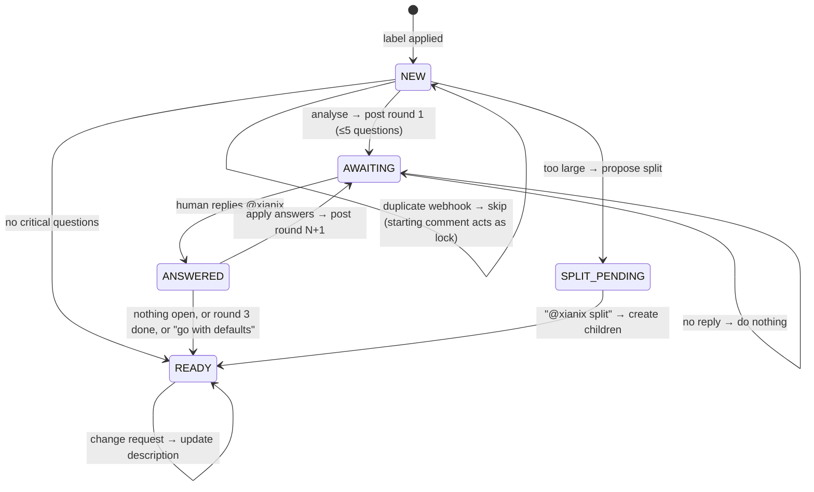

# Requirement Analyst Plugin

> A **conversational grooming partner** for backlog items. Instead of posting a long analysis, it asks the few questions that actually change what gets built, folds the answers into the issue description, and marks the item ready when it is groomed — all inside the issue / work item comment thread.

Works with **GitHub Issues**, **Azure DevOps Work Items**, or **plain text input**.

---

## The Conversation

```
Human    adds the `ai-dlc/issue/analyze` label
Agent    ── round 1 ──  "What I understand: … Decisions I need: Q1 … Q2 … Q3 … (each with a default)"
Human    "@xianix 1. yes  2. admins only"
Agent    updates the description with Q1, Q2 → posts round 2: "Still open: Q3 …"
Human    "@xianix go with defaults"
Agent    updates the description, marks it `groomed` → "Ready to proceed. Assumptions: Q3 → …"
```

Each run of the plugin is **one turn**. It reads the whole thread, works out where the conversation stands, takes exactly one action, and stops. The human's reply triggers the next turn.

What the humans see per turn:

- **Round comment** — 2–3 sentences of understanding, up to **5 numbered questions**, each one line with *why it matters* and a *default*. Readable in under a minute.
- **Description** — rewritten into a concise structured requirement: summary, scope, requirements, acceptance criteria, a *Decisions* table (who decided what, linked to the comment), open questions. The original text is preserved verbatim in a collapsed block.
- **Label / tag** — exactly one of `needs-clarification` (a round is open), `needs-decomposition` (too large — split proposed), `groomed` (ready to proceed).

The analysis depth is still there — repo documentation, fit with existing PRDs / ADRs, intent, personas, journey, domain — but it stays **internal** and surfaces only as questions or as lines in the refined description. On GitHub, the analyst notes are available as an optional collapsed block in the round-1 comment.

---

## State Machine


```mermaid
stateDiagram-v2
    [*] --> NEW: label applied
    NEW --> NEW: duplicate webhook → skip (starting comment acts as lock)
    NEW --> AWAITING: analyse → post round 1 (≤5 questions)
    NEW --> READY: no critical questions
    NEW --> SPLIT_PENDING: too large → propose split
    AWAITING --> ANSWERED: human replies @xianix
    AWAITING --> AWAITING: no reply → do nothing
    ANSWERED --> AWAITING: apply answers → post round N+1
    ANSWERED --> READY: nothing open, or round 3 done, or "go with defaults"
    SPLIT_PENDING --> READY: "@xianix split" → create children
    READY --> READY: change request → update description
```

State is derived from the thread itself — every agent comment ends with a footer `` `req-analyst` · round N/3 · status: … `` that the next run parses. Nothing is stored elsewhere.

**Bounds:** max 5 questions per round, max 3 rounds. Unanswered questions after round 3 resolve to their stated defaults, are flagged **(assumed)** in the description, and the item is marked ready.

---

## How to Reply

Comment on the item, addressing the agent:

| You write | Effect |
|---|---|
| `@xianix 1. yes 2. admins only 3. skip for v1` | Answers by number — folded into the description |
| `@xianix Q2 should be admins only` | Prose answers work too |
| `@xianix go with defaults` | Accept every proposed default → item marked ready |
| `@xianix split` | Confirm a proposed decomposition → child items created and linked |
| `@xianix keep as one` | Reject a proposed split → groom as a single item |
| `@xianix hold` | Park it — no further rounds until you reply again |
| `@xianix what do you mean by 3?` | Short reply, no state change |

Editing the description directly also works — the next run re-checks open questions against it.

---

## Quick Start

### Prerequisites

- [Claude Code](https://docs.anthropic.com/claude-code) installed (`claude` CLI)
- **GitHub:** `gh` CLI authenticated with `repo` scope (the plugin edits the body and labels) — or `GITHUB-TOKEN`
- **Azure DevOps:** `AZURE-DEVOPS-TOKEN` PAT with `Work Items (Read & Write)`
- **Plain text:** nothing — the conversation lives in `requirement-grooming.md`

### Run

```bash
claude --plugin-dir /path/to/xianix-plugins-official/plugins/req-analyst

# In the chat — run once per turn
/requirement-analysis 42
```

See [docs/platform-config.md](docs/platform-config.md) for credentials and [docs/backlog-setup.md](docs/backlog-setup.md) for labels and item structure.

---

## Inputs

| Input | Source | Required | Description |
|---|---|---|---|
| Repository URL | Agent rule | Yes | Repository containing the backlog item |
| Issue / work-item number | Prompt | Yes | The item to groom |

Platform is **auto-detected** from `git remote`.

## Environment Variables

| Variable | Platform | Purpose |
|---|---|---|
| `GITHUB-TOKEN` | GitHub | Read issue + comments, post comments, edit body, swap labels |
| `AZURE-DEVOPS-TOKEN` | Azure DevOps | Read work item + comments, post comments, patch description / tags |

For CI, `PLATFORM`, `REPO_URL`, and `ISSUE_NUMBER` drive the plugin without interactive input.

---

## Rule Examples (Xianix Agent)

Two kinds of trigger are needed for the loop to run unattended:

| Trigger | Purpose |
|---|---|
| **Label / tag applied** | Starts the conversation (round 1) |
| **`@xianix` comment on the item** | Continues it — every human reply runs the next turn |

The plugin reads the whole thread each time, so the comment trigger does not need to pass the answers in; it only needs to run `/requirement-analysis` on the item.

| Platform | Scenario | Webhook event | Filter rule |
|---|---|---|---|
| GitHub | Label applied | `issues` | `action==labeled` and `label.name=='ai-dlc/issue/analyze'` |
| GitHub | Issue opened with label | `issues` | `action==opened` and `ai-dlc/issue/analyze` in `issue.labels` |
| GitHub | Human replies | `issue_comment` | `action==created` and `comment.body` contains `@xianix` and **not** `issue.pull_request?` |
| Azure DevOps | Tag applied | `workitem.updated` | `ai-dlc/issue/analyze` newly in `System.Tags` |
| Azure DevOps | Created with tag | `workitem.created` | `ai-dlc/issue/analyze` in `System.Tags` |
| Azure DevOps | Human replies | `workitem.commented` | `resource.fields.System.History` contains `@xianix` |

### GitHub — start the conversation

```json
{
  "name": "github-issue-requirement-analysis",
  "match-any": [
    { "name": "github-issue-tag-applied",      "rule": "action==labeled&&label.name=='ai-dlc/issue/analyze'" },
    { "name": "github-issue-opened-with-tag",  "rule": "action==opened&&issue.labels.*.name=='ai-dlc/issue/analyze'" }
  ],
  "use-inputs": [
    { "name": "issue-number",    "value": "issue.number" },
    { "name": "repository-url",  "value": "repository.clone_url" },
    { "name": "repository-name", "value": "repository.full_name" },
    { "name": "issue-title",     "value": "issue.title" },
    { "name": "platform",        "value": "github", "constant": true }
  ],
  "use-plugins": [
    { "plugin-name": "req-analyst@xianix-plugins-official", "marketplace": "xianix-team/plugins-official" }
  ],
  "with-envs": [
    { "name": "GITHUB-TOKEN", "value": "secrets.GITHUB-TOKEN", "mandatory": true }
  ],
  "conversation-key": "issue.number",
  "execute-prompt": "Issue #{{issue-number}} titled \"{{issue-title}}\" in {{repository-name}} has been tagged with `ai-dlc/issue/analyze`.\n\nRun /requirement-analysis {{issue-number}}. The command reads the full comment thread and takes the next grooming step (round 1 if none exists). You must post the round comment on the issue yourself with `gh issue comment`; your text output alone is not delivered to the user."
}
```

### GitHub — continue the conversation

```json
{
  "name": "github-issue-requirement-analysis-reply",
  "match-any": [
    { "name": "github-issue-agent-reply", "rule": "action==created&&comment.body*='@xianix'&&issue.pull_request!?" }
  ],
  "use-inputs": [
    { "name": "issue-number",     "value": "issue.number", "mandatory": true },
    { "name": "issue-title",      "value": "issue.title" },
    { "name": "repository-url",   "value": "repository.clone_url" },
    { "name": "repository-name",  "value": "repository.full_name" },
    { "name": "comment-author",   "value": "comment.user.login" },
    { "name": "comment-id",       "value": "comment.id" },
    { "name": "user-instruction", "value": "comment.body" },
    { "name": "platform",         "value": "github", "constant": true }
  ],
  "use-plugins": [
    { "plugin-name": "req-analyst@xianix-plugins-official", "marketplace": "xianix-team/plugins-official" }
  ],
  "with-envs": [
    { "name": "GITHUB-TOKEN", "value": "secrets.GITHUB-TOKEN", "mandatory": true }
  ],
  "conversation-key": "issue.number",
  "execute-prompt": "You are @xianix. {{comment-author}} commented on issue #{{issue-number}} (\"{{issue-title}}\") in {{repository-name}}: \"{{user-instruction}}\"\n\nFirst decide whether this comment is addressed to you (an answer to your questions, an instruction like \"go with defaults\" / \"split\" / \"hold\", or a question for you) versus mentioning you in passing. If it is not addressed to you, do nothing and post no reply.\n\nIf it is addressed to you, react to comment {{comment-id}} with `eyes`, then run /requirement-analysis {{issue-number}}. The command reads the full thread — including this comment — and takes the next grooming step: fold the answers into the description and post the next round, or mark the item ready. Post exactly one comment; your text output alone is not delivered to the user."
}
```

> **Why the "is it addressed to me?" preamble?** A bare substring match on `@xianix` also fires when someone mentions the agent in passing. The `!issue.pull_request?` guard keeps this rule off PR comments, which other plugins handle.

### Azure DevOps — start the conversation

```json
{
  "name": "azuredevops-work-item-requirement-analysis",
  "match-any": [
    { "name": "azuredevops-workitem-tag-applied",       "rule": "eventType==workitem.updated&&resource.revision.fields.\"System.Tags\"*='ai-dlc/issue/analyze'&&resource.fields.\"System.Tags\".oldValue!*='ai-dlc/issue/analyze'" },
    { "name": "azuredevops-workitem-created-with-tag",  "rule": "eventType==workitem.created&&resource.fields.\"System.Tags\"*='ai-dlc/issue/analyze'" }
  ],
  "use-inputs": [
    { "name": "workitem-id",     "value": "resource.workItemId" },
    { "name": "workitem-title",  "value": "resource.revision.fields.\"System.Title\"" },
    { "name": "workitem-type",   "value": "resource.revision.fields.\"System.WorkItemType\"" },
    { "name": "project-name",    "value": "resource.revision.fields.\"System.TeamProject\"" },
    { "name": "repository-url",  "value": "https://org@dev.azure.com/org/Project/_git/Repo", "constant": true },
    { "name": "platform",        "value": "azuredevops", "constant": true }
  ],
  "use-plugins": [
    { "plugin-name": "req-analyst@xianix-plugins-official", "marketplace": "xianix-team/plugins-official" }
  ],
  "with-envs": [
    { "name": "AZURE-DEVOPS-TOKEN", "value": "secrets.AZURE-DEVOPS-TOKEN", "mandatory": true }
  ],
  "conversation-key": "resource.workItemId",
  "execute-prompt": "Work item ({{workitem-type}}) #{{workitem-id}} titled \"{{workitem-title}}\" in project {{project-name}} has been tagged with `ai-dlc/issue/analyze`.\n\nRun /requirement-analysis {{workitem-id}}. The command reads the full discussion thread and takes the next grooming step (round 1 if none exists). You must post the round comment on the work item yourself via the Work Item Comments REST API; your text output alone is not delivered to the user."
}
```

### Azure DevOps — continue the conversation

```json
{
  "name": "azuredevops-work-item-requirement-analysis-reply",
  "match-any": [
    { "name": "azuredevops-workitem-agent-reply", "rule": "eventType==workitem.commented&&resource.fields.System.History*='@xianix'" }
  ],
  "use-inputs": [
    { "name": "workitem-id",      "value": "resource.id", "mandatory": true },
    { "name": "workitem-title",   "value": "resource.fields.System.Title" },
    { "name": "user-instruction", "value": "resource.fields.System.History" },
    { "name": "repository-url",   "value": "https://org@dev.azure.com/org/Project/_git/Repo", "constant": true },
    { "name": "platform",         "value": "azuredevops", "constant": true }
  ],
  "use-plugins": [
    { "plugin-name": "req-analyst@xianix-plugins-official", "marketplace": "xianix-team/plugins-official" }
  ],
  "with-envs": [
    { "name": "AZURE-DEVOPS-TOKEN", "value": "secrets.AZURE-DEVOPS-TOKEN", "mandatory": true }
  ],
  "conversation-key": "resource.id",
  "execute-prompt": "You are @xianix. Someone commented on work item #{{workitem-id}} (\"{{workitem-title}}\"): \"{{user-instruction}}\"\n\nFirst decide whether this comment is addressed to you (an answer to your questions, an instruction like \"go with defaults\" / \"split\" / \"hold\", or a question for you) versus mentioning you in passing. If it is not addressed to you, do nothing and post no reply.\n\nIf it is addressed to you, run /requirement-analysis {{workitem-id}}. The command reads the full discussion — including this comment — and takes the next grooming step: fold the answers into the description and post the next round, or mark the item ready. Post exactly one comment via the Work Item Comments REST API; your text output alone is not delivered to the user."
}
```

> These blocks go inside the `executions` array of a rule set. `conversation-key` groups all turns on one item into one conversation.

---

## Documentation

| Document | Description |
|---|---|
| [docs/platform-config.md](docs/platform-config.md) | Credentials — GitHub CLI, Azure DevOps PAT, CI env vars |
| [docs/backlog-setup.md](docs/backlog-setup.md) | Labels, item structure, how to answer |
| [providers/github.md](providers/github.md) | GitHub — thread fetch, reactions, body edit, label swap |
| [providers/azure-devops.md](providers/azure-devops.md) | Azure DevOps — comments API, description / AC patch, tag swap |
| [providers/generic.md](providers/generic.md) | Plain text — file-based conversation |
| [styles/conversation.md](styles/conversation.md) | Tone and brevity rules |
| [styles/round-comment-template.md](styles/round-comment-template.md) | The comment variants |
| [styles/refined-description-template.md](styles/refined-description-template.md) | The description the plugin maintains |
