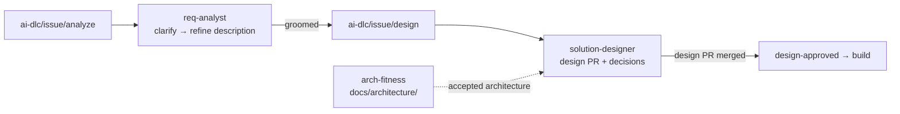
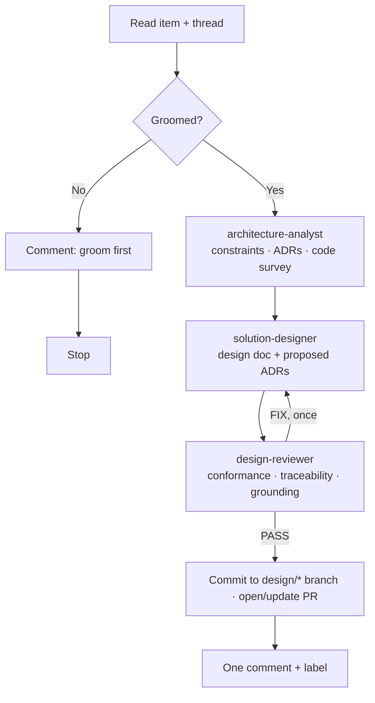

# Solution Designer Plugin

> Turns a **groomed** backlog item into a **software design that fits the architecture the team has already accepted**. Reads the architecture constraints and ADRs, looks at the code the requirement touches, and opens a design PR. Any change the architecture needs is proposed as an ADR, not made silently. The conversation happens in the issue / work item comments, like `req-analyst`.

Works with **GitHub Issues**, **Azure DevOps Work Items**, or **plain text**. Triggered by the `ai-dlc/issue/design` label / tag.

---

## Where It Fits



| Plugin | Owns |
|---|---|
| `req-analyst` | The requirement: the item description, grooming questions, `groomed` |
| `arch-fitness` | The accepted architecture: `docs/architecture/constraints.md`, fitness functions, ADRs |
| `solution-designer` | The design: `docs/design/<id>-<slug>.md`, proposed ADRs, the design PR |

The designer **never edits the item description** and **never edits ratified constraints**. It reads both and writes only under `docs/`.

---

## What It Produces

**1. A design PR** from `design/issue-<n>-<slug>` containing `docs/design/<id>-<slug>.md`:

| Section | Content |
|---|---|
| Header | Item link, status, revision, architecture baseline used, requirement snapshot time |
| Shape | Flowchart of the components involved, then a table (path, change, what it does) |
| Flow | One sequence diagram of the happy path; failure paths as table rows |
| Contracts / Data / Cross-cutting | Tables. A fenced example only when the table cannot show the shape |
| Alternatives | Table, only when a real alternative was weighed |
| Conformance | Each constraint / ADR: *complies* or *deviation → ADR proposed* |
| **Traceability** | Every requirement `R<n>` and AC → design element |
| Risks & decisions | `D<n>` with proposed defaults and who resolved them |
| Implementation plan | Ordered, independently mergeable slices |

Sections with nothing specific to say are omitted — a small story gets a one-page design.

**2. Proposed ADRs** (`Status: proposed`) in the repo's ADR folder whenever the design needs something the accepted architecture forbids or does not cover.

**3. One short comment** on the item: a table of what changes and where, the PR link, the conformance line, and up to 4 numbered decisions with defaults. The diagrams stay in the doc — work-item discussions do not render them.

**4. One design label / tag:** `design-needs-decision` → `design-proposed` → `design-approved`.

---

## How It Works



| Agent | Role |
|---|---|
| **orchestrator** | State from the thread, gating, delivery (branch, PR, comment, label) |
| **architecture-analyst** | Establishes the accepted architecture and where the requirement lands in the code |
| **solution-designer** | Writes the design inside that architecture; proposes ADRs for deviations |
| **design-reviewer** | Checks conformance, traceability, real paths, failure handling; returns PASS or fixes |

**Architecture baseline.** Ratified constraints and accepted ADRs are binding; proposed ones are advisory. If the repo has none, the designer infers rules from the code (`INF-n`), says so in the doc, and recommends running `arch-fitness --docs-only` to ratify them. It does not write `docs/architecture/` itself.

**Grooming gate.** The design starts only when the item carries `groomed` (or `req-analyst` reported *ready*). Otherwise it posts a one-line note. Override with `@xianix design anyway` or `--force`.

**Staleness.** The doc records the time of the requirement it was based on. If the item description changes afterwards, the next run re-designs against the new requirement and summarises what changed.

---

## The Conversation

```
Human    adds `ai-dlc/issue/design` to a groomed issue
Agent    "Design r1 — your decision."
         table: POST /orders/{id}/cancel → routes.ts · policy NEW → cancellation.ts
         "D1 — refund sync or by event? Default: event (ADR-0007)"
Human    "@xianix 1. event, and reuse NotificationService for the email"
Agent    revises the doc on the same branch → "Design r2 — ready for review. Applied: D1 → event"
Human    merges the design PR
Agent    "Design approved" → `design-approved`
```

| You write | Effect |
|---|---|
| `@xianix 1. event 2. no` | Answer decisions by number |
| `@xianix <feedback>` | Revise the design (new revision on the same PR) |
| `@xianix go with defaults` | Accept all open decision defaults |
| `@xianix approve` | Mark approved (merging the PR does the same) |
| `@xianix design anyway` | Skip the grooming gate |
| `@xianix hold` | Pause |

Review comments on the design PR itself are also fine — but ask for a revision on the item with `@xianix` so the doc and the thread stay in sync.

**Sharing the thread with `req-analyst`.** Both plugins listen for `@xianix` on the same item. A reply goes to whichever plugin posted the most recent agent comment, unless it clearly names the other one (design / architecture / `D<n>` vs requirement / `Q<n>`).

---

## Quick Start

```bash
claude --plugin-dir /path/to/xianix-plugins-official/plugins/solution-designer
/software-design 42
/software-design 42 --force      # skip the grooming gate
/architecture-brief 42           # just the architecture brief, no PR
```

### Prerequisites

- **GitHub:** `gh` authenticated; token with Contents, Issues, Pull requests: Read & Write
- **Azure DevOps:** `AZURE-DEVOPS-TOKEN` with Work Items and Code: Read & Write
- git `user.name` / `user.email` configured

See [docs/platform-config.md](docs/platform-config.md).

**Safety rails (enforced by the pre-tool hook):** pushes only from `design/*` branches; commits only files under `docs/`.

---

## Rule Examples (Xianix Agent)

| Platform | Scenario | Webhook event | Filter |
|---|---|---|---|
| GitHub | Tag applied | `issues` | `action==labeled` and `label.name=='ai-dlc/issue/design'` |
| GitHub | Human replies | `issue_comment` | `action==created`, body contains `@xianix`, not a PR, issue has `ai-dlc/issue/design` |
| GitHub | Design PR closed *(optional)* | `pull_request` | `action==closed`, head ref contains `design/issue-` (agent checks it was merged) |
| Azure DevOps | Tag applied | `workitem.updated` | `ai-dlc/issue/design` newly in `System.Tags` |
| Azure DevOps | Human replies | `workitem.commented` | `System.History` contains `@xianix` and `System.Tags` contains `ai-dlc/issue/design` |

### GitHub — start

```json
{
  "name": "github-issue-software-design",
  "match-any": [
    { "name": "github-issue-design-tag-applied", "rule": "action==labeled&&label.name=='ai-dlc/issue/design'" }
  ],
  "use-inputs": [
    { "name": "issue-number",    "value": "issue.number" },
    { "name": "issue-title",     "value": "issue.title" },
    { "name": "repository-url",  "value": "repository.clone_url" },
    { "name": "repository-name", "value": "repository.full_name" },
    { "name": "platform",        "value": "github", "constant": true }
  ],
  "use-plugins": [
    { "plugin-name": "solution-designer@xianix-plugins-official", "marketplace": "xianix-team/plugins-official" }
  ],
  "with-envs": [
    { "name": "GITHUB-TOKEN", "value": "secrets.GITHUB-TOKEN", "mandatory": true }
  ],
  "conversation-key": "issue.number",
  "execute-prompt": "Issue #{{issue-number}} (\"{{issue-title}}\") in {{repository-name}} has been tagged `ai-dlc/issue/design`.\n\nRun /software-design {{issue-number}}. It checks the item is groomed, designs it against the repository's accepted architecture, opens a design PR, and posts one comment. You must post the comment yourself with `gh issue comment`; your text output alone is not delivered to the user."
}
```

### GitHub — continue

```json
{
  "name": "github-issue-software-design-reply",
  "match-any": [
    { "name": "github-issue-design-reply", "rule": "action==created&&comment.body*='@xianix'&&issue.pull_request!?&&issue.labels.*.name=='ai-dlc/issue/design'" }
  ],
  "use-inputs": [
    { "name": "issue-number",     "value": "issue.number", "mandatory": true },
    { "name": "issue-title",      "value": "issue.title" },
    { "name": "repository-url",   "value": "repository.clone_url" },
    { "name": "repository-name",  "value": "repository.full_name" },
    { "name": "comment-author",   "value": "comment.user.login" },
    { "name": "comment-id",       "value": "comment.id" },
    { "name": "user-instruction", "value": "comment.body" },
    { "name": "platform",         "value": "github", "constant": true }
  ],
  "use-plugins": [
    { "plugin-name": "solution-designer@xianix-plugins-official", "marketplace": "xianix-team/plugins-official" }
  ],
  "with-envs": [
    { "name": "GITHUB-TOKEN", "value": "secrets.GITHUB-TOKEN", "mandatory": true }
  ],
  "conversation-key": "issue.number",
  "execute-prompt": "You are @xianix. {{comment-author}} commented on issue #{{issue-number}} (\"{{issue-title}}\"): \"{{user-instruction}}\"\n\nDecide whether this comment is for the design conversation: the most recent agent comment on the thread is a `solution-designer` comment, or the comment clearly refers to the design (design, architecture, a D<n> id, the design PR, `approve`, `design anyway`). If it is for the requirement conversation or mentions you in passing, do nothing and post no reply.\n\nOtherwise react to comment {{comment-id}} with `eyes` and run /software-design {{issue-number}}. Post exactly one comment with `gh issue comment`; your text output alone is not delivered to the user."
}
```

### GitHub — design PR merged (optional)

Without this rule, a merged design PR is picked up as *approved* on the next `@xianix` reply.

```json
{
  "name": "github-design-pr-merged",
  "match-any": [
    { "name": "github-design-pr-merged", "rule": "action==closed&&pull_request.head.ref*='design/issue-'" }
  ],
  "use-inputs": [
    { "name": "head-ref",        "value": "pull_request.head.ref" },
    { "name": "repository-url",  "value": "repository.clone_url" },
    { "name": "platform",        "value": "github", "constant": true }
  ],
  "use-plugins": [
    { "plugin-name": "solution-designer@xianix-plugins-official", "marketplace": "xianix-team/plugins-official" }
  ],
  "with-envs": [
    { "name": "GITHUB-TOKEN", "value": "secrets.GITHUB-TOKEN", "mandatory": true }
  ],
  "execute-prompt": "The design PR from branch `{{head-ref}}` was closed. Extract the issue number from the branch name (`design/issue-<n>-…`) and run /software-design <n>. It marks the design approved only if the PR was merged; a PR closed without merging needs no action."
}
```

### Azure DevOps — start

```json
{
  "name": "azuredevops-work-item-software-design",
  "match-any": [
    { "name": "azuredevops-workitem-design-tag-applied", "rule": "eventType==workitem.updated&&resource.revision.fields.\"System.Tags\"*='ai-dlc/issue/design'&&resource.fields.\"System.Tags\".oldValue!*='ai-dlc/issue/design'" }
  ],
  "use-inputs": [
    { "name": "workitem-id",    "value": "resource.workItemId" },
    { "name": "workitem-title", "value": "resource.revision.fields.\"System.Title\"" },
    { "name": "repository-url", "value": "https://org@dev.azure.com/org/Project/_git/Repo", "constant": true },
    { "name": "platform",       "value": "azuredevops", "constant": true }
  ],
  "use-plugins": [
    { "plugin-name": "solution-designer@xianix-plugins-official", "marketplace": "xianix-team/plugins-official" }
  ],
  "with-envs": [
    { "name": "AZURE-DEVOPS-TOKEN", "value": "secrets.AZURE-DEVOPS-TOKEN", "mandatory": true }
  ],
  "conversation-key": "resource.workItemId",
  "execute-prompt": "Work item #{{workitem-id}} (\"{{workitem-title}}\") has been tagged `ai-dlc/issue/design`.\n\nRun /software-design {{workitem-id}}. It checks the item is groomed, designs it against the repository's accepted architecture, opens a design PR linked to the work item, and posts one comment via the Work Item Comments REST API; your text output alone is not delivered to the user."
}
```

### Azure DevOps — continue

```json
{
  "name": "azuredevops-work-item-software-design-reply",
  "match-any": [
    { "name": "azuredevops-workitem-design-reply", "rule": "eventType==workitem.commented&&resource.fields.System.History*='@xianix'&&resource.fields.System.Tags*='ai-dlc/issue/design'" }
  ],
  "use-inputs": [
    { "name": "workitem-id",      "value": "resource.id", "mandatory": true },
    { "name": "workitem-title",   "value": "resource.fields.System.Title" },
    { "name": "user-instruction", "value": "resource.fields.System.History" },
    { "name": "repository-url",   "value": "https://org@dev.azure.com/org/Project/_git/Repo", "constant": true },
    { "name": "platform",         "value": "azuredevops", "constant": true }
  ],
  "use-plugins": [
    { "plugin-name": "solution-designer@xianix-plugins-official", "marketplace": "xianix-team/plugins-official" }
  ],
  "with-envs": [
    { "name": "AZURE-DEVOPS-TOKEN", "value": "secrets.AZURE-DEVOPS-TOKEN", "mandatory": true }
  ],
  "conversation-key": "resource.id",
  "execute-prompt": "You are @xianix. Someone commented on work item #{{workitem-id}} (\"{{workitem-title}}\"): \"{{user-instruction}}\"\n\nDecide whether this comment is for the design conversation: the most recent agent comment is a `solution-designer` comment, or the comment clearly refers to the design (design, architecture, a D<n> id, the design PR, `approve`, `design anyway`). If not, do nothing and post no reply.\n\nOtherwise run /software-design {{workitem-id}} and post exactly one comment via the Work Item Comments REST API."
}
```

> **Chaining from grooming.** To design automatically once grooming finishes, add a rule on `action==labeled&&label.name=='groomed'` that applies `ai-dlc/issue/design` — or keep it manual so a human decides which groomed items need a design.

---

## Documentation

| Document | Description |
|---|---|
| [docs/platform-config.md](docs/platform-config.md) | Credentials, permissions, labels |
| [providers/github.md](providers/github.md) | Thread, branch, PR, labels on GitHub |
| [providers/azure-devops.md](providers/azure-devops.md) | Work item, Azure Repos PR, tags |
| [providers/generic.md](providers/generic.md) | Plain text / local file mode |
| [styles/design-doc-template.md](styles/design-doc-template.md) | The design document |
| [styles/design-comment-template.md](styles/design-comment-template.md) | Comment variants and footer marker |
