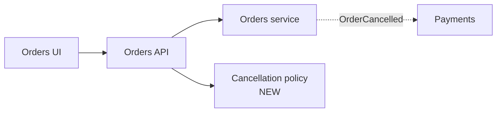
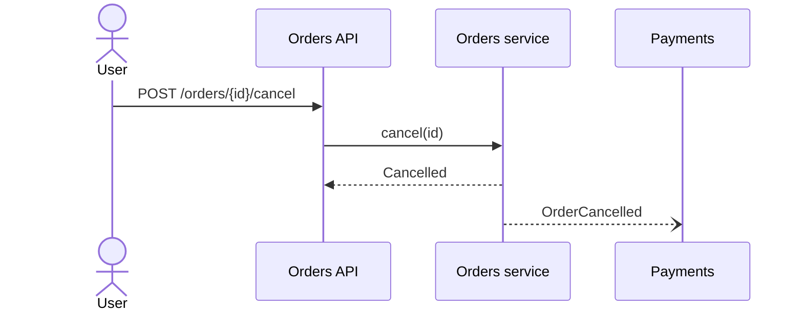

# Design Doc Template

Written to `docs/design/<id>-<slug>.md`. Section order is fixed. **Omit a section that would be empty** — except the header, *Shape*, *Conformance*, *Traceability*, and *Plan*.

A human should get the design from the pictures and tables. Prose is a last resort: one line, never a paragraph. If a sentence restates a row in a table, delete the sentence.

| Item size | Shape diagram | Sequence diagram | Everything else |
|---|---|---|---|
| Small (1–2 components, one flow) | Required | Required if a user or another system is involved | Tables only, often just conformance + traceability + plan |
| Medium | Required | Required — one diagram, the main path | Tables |
| Large | Required | Main path + at most one alternate | Tables. If this needs a second sequence diagram, the item should have been split |

---

```markdown
# Design: <title>

| | |
|---|---|
| **Item** | [#<id> — <title>](<url>) |
| **Status** | Needs decision · Proposed · Approved |
| **Revision** | r<N> |
| **Does** | <one line: who gets what, and the one design choice that matters> |
| **Baseline** | ratified · proposed · inferred — <`constraints.md`, ADR-0004, ADR-0007> |
| **Requirement as of** | <ISO timestamp of the description this was designed from> |

## Shape

<How the change sits in the system. Boxes are components; edges are calls or events. Mark **new** nodes. Reuse names from the architecture brief.>



| Component | Path | Change | Does |
|---|---|---|---|
| Orders API | `src/api/orders/routes.ts` | changed | `POST /orders/{id}/cancel` |
| Cancellation policy | `src/domain/orders/cancellation.ts` | **new** | Can this order be cancelled |

## Flow

<The happy path. Participants match the Shape diagram.>



| Path | When | Result |
|---|---|---|
| Shipped | AC2 | `409 ORDER_NOT_CANCELLABLE` |
| Payment already captured | AC3 | event still emitted; refund is async |

## Contracts

| Kind | Name | Shape | Compatibility |
|---|---|---|---|
| HTTP | `POST /orders/{id}/cancel` | `200 {status, refundId}` · `409 {error, reason}` | additive |
| Event | `OrderCancelled` | `{orderId, refundId}` | additive |

<One fenced example only when the table cannot show the shape. No surrounding prose.>

## Data

| Store | Change | Owner | Migration |
|---|---|---|---|
| `orders.status` | add `cancelled` | Orders | `migrations/<next>_cancel_order.sql` |

## Cross-cutting

| Concern | Decision |
|---|---|
| Authz | caller must own the order — same check as `src/api/orders/update.ts` |
| Rollout | flag `order_cancel` |

## Alternatives

| Option | Why not |
|---|---|
| Sync refund call | Breaks ADR-0007 |

## Conformance

| Constraint | | How |
|---|---|---|
| ARCH-003 No repo access from controllers | complies | route → `OrdersService` only |
| ADR-0007 Events between modules | complies | refund via `OrderCancelled` |
| ARCH-009 No sync cross-module calls | **deviation → ADR-0012** | sync stock check |

## Traceability

| Requirement | Covered by |
|---|---|
| R1 cancel before shipping | `POST /orders/{id}/cancel`, `CancellationPolicy` |
| AC2 shipped orders rejected | `409` row in Flow |

## Decisions

| # | Question | Default | Resolved |
|---|---|---|---|
| D1 | Refund sync or by event? | Event, per ADR-0007 | — |
| D2 | Partial cancel? | No — whole order | @alice — [comment](<url>) |

## Plan

| # | Slice | Delivers | Tests |
|---|---|---|---|
| 1 | Migration + `CancellationPolicy` | status + decision | unit |
| 2 | Service + event | cancel + `OrderCancelled` | unit |
| 3 | Route | `POST /orders/{id}/cancel` | contract |

## Out of scope

Partial cancel · bulk cancel

## Revisions

| Rev | What changed |
|---|---|
| r1 | initial |
| r2 | D1 → event; AC3 path (@alice) |
```

---

## Rules

- **Diagrams use the brief's names and paths.** A box with no row in the Shape table is a mistake; a row with no box is fine (data-only change).
- **Baseline `inferred`:** ids are `INF-1…`. Add one Decisions row: "No ratified constraints — inferred from code. Ratify with `arch-fitness --docs-only`."
- **Requirement ids** come from the `req-analyst` managed section; otherwise number `R1…` in reading order.
- **Status** matches the comment footer: `needs decision` · `proposed` · `approved`.
