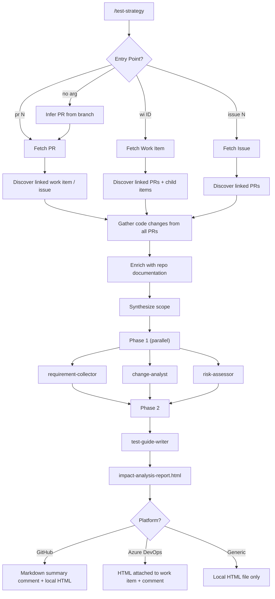

# Test Strategist Plugin

> Risk-based impact analysis and test strategy generation for QA engineers.

Given a PR number, Azure DevOps work item ID, or GitHub issue number, this plugin resolves all linked context — requirements, code changes, child items, comments, and documentation — then produces a **self-contained HTML report** (`impact-analysis-report.html`) with test cases, a coverage map, and a QA sign-off checklist.

Reports are written for **QA engineers, product owners, and non-technical stakeholders**. Test cases describe _what_ to verify and _why it matters_ — not which line of code changed.

---

## Quick Start

```
/test-strategy pr 87
/test-strategy wi 4521
/test-strategy issue 203
/test-strategy              # infers PR from current branch
```

### Flags

| Flag | Purpose |
|---|---|
| `--no-perf` | Skip performance test case generation |
| `--no-a11y` | Skip accessibility & usability test case generation |

```
/test-strategy pr 87 --no-perf --no-a11y
```

---

## How It Works



---

## Entry Points

The command accepts three entry points. Only one is needed — the orchestrator resolves the rest automatically via bidirectional discovery.

| Entry Point | Example | What the agent does |
|---|---|---|
| **PR number** | `/test-strategy pr 87` | Fetches the PR diff, then discovers the linked work item or issue to read requirements |
| **Azure DevOps Bug or PBI ID** | `/test-strategy wi 4521` | Fetches the work item fields and comments, then discovers all linked and child PRs |
| **GitHub Issue number** | `/test-strategy issue 203` | Fetches the issue body and comments, then discovers all linked pull requests |
| **No argument** | `/test-strategy` | Infers the PR from the active branch |

---

## Agent Pipeline

### Phase 1 — Context Gathering (parallel)

| Agent | Focus |
|---|---|
| **requirement-collector** | Consolidates requirements: acceptance criteria (PBI/Feature), repro steps + root cause (Bug), child items, comments, referenced documentation |
| **change-analyst** | Maps code changes to functional areas; cross-references against requirements; flags "Developer Changes Requiring Clarification" for unexplained changes |
| **risk-assessor** | Business-level risk summary: what could break, who is affected, how severe; impacted areas with ratings |

### Phase 2 — Report Generation

| Agent | Focus |
|---|---|
| **test-guide-writer** | Produces the final HTML report with 12 sections, test cases across 7 categories, coverage map, and QA sign-off checklist |

---

## Report Sections

The HTML report contains 12 sections:

| # | Section | Purpose |
|---|---|---|
| 1 | **Summary** | Work item metadata, overall risk, test case count, linked PRs |
| 2 | **Context Gathered** | Linked PRs, child work items, changesets, referenced documentation |
| 3 | **Code Changes Overview** | Per-PR cards with file-level summaries — no raw diffs |
| 4 | **Requirements Coverage** | Each requirement mapped to the code changes that address it |
| 5 | **Developer Changes Requiring Clarification** | Code changes not explained by any stated requirement — flagged for discussion before testing |
| 6 | **Missing Requirement Coverage** | Requirements with no corresponding code change found |
| 7 | **Business Risk Assessment** | What could go wrong, who is affected, how severe — business language |
| 8 | **Test Cases** | All test scenarios across seven categories |
| 9 | **Coverage Map** | Matrix: requirements → test cases, risks → test cases, explicitly out of scope |
| 10 | **Impacted Areas** | Direct and indirect impact on user workflows, integrations, and data |
| 11 | **Environment & Assignment** | Area path, iteration, developer, tester, environment/data/account needs |
| 12 | **QA Sign-off** | Interactive checklist for the tester to confirm completion |

---

## Test Case Categories

| Emoji | Category | When generated |
|---|---|---|
| 🟢 | **Functional** | Always |
| 🔵 | **Performance** | Change touches a service, query, or data pipeline (skipped with `--no-perf`) |
| 🔴 | **Security** | Change touches authentication, data input, API surfaces, or permissions |
| 🟡 | **Privacy & PII** | Change handles personal, financial, or health data |
| 🟣 | **Accessibility & Usability** | Change touches any user interface (skipped with `--no-a11y`) |
| ⚪ | **Resilience** | Change touches a service call, queue, or external dependency |
| 🟤 | **Compatibility** | Change touches a UI, public API, integration point, or shared contract |

Categories with no realistic surface are skipped automatically.

---

## Platform Support

The plugin auto-detects the hosting platform from the git remote URL:

| Remote URL contains | Platform | Fetch | Deliver |
|---|---|---|---|
| `github.com` | GitHub | `gh` CLI | Markdown summary comment on the issue/PR + local `impact-analysis-report.html` |
| `dev.azure.com` / `visualstudio.com` | Azure DevOps | REST API | HTML report **attached to the work item** + notification comment (+ PR thread if triggered from PR) |
| Anything else | Generic | Git + user input | Local `impact-analysis-report.html` only |

---

## Rule Examples

### GitHub — PR

```
When using test-strategist on a GitHub repository and a PR number is provided,
you should /test-strategy pr 87

This will:
1. Fetch the PR diff and metadata via gh CLI
2. Discover linked issues from closingIssuesReferences and PR body
3. Fetch each linked issue's body, labels, and comments
4. Run the 4-agent pipeline
5. Post a markdown summary comment on the PR
6. Write impact-analysis-report.html locally
```

### GitHub — Issue

```
When using test-strategist on a GitHub repository and an issue number is provided,
you should /test-strategy issue 203

This will:
1. Fetch the issue body, labels, and comments via gh CLI
2. Discover linked PRs via timeline API and body search
3. Fetch diffs from each linked PR
4. Run the 4-agent pipeline
5. Post a markdown summary comment on the issue
6. Write impact-analysis-report.html locally
```

### Azure DevOps — PR

```
When using test-strategist on an Azure DevOps repository and a PR number is provided,
you should /test-strategy pr 42

This will:
1. Fetch the PR metadata and iterations via REST API
2. Discover linked work items from the PR
3. Fetch each work item with all fields, comments, and relations
4. Fetch child work items and changesets
5. Run the 4-agent pipeline
6. Attach impact-analysis-report.html to the work item
7. Post a notification comment on the work item and a thread on the PR
```

### Azure DevOps — Work Item

```
When using test-strategist on an Azure DevOps repository and a work item ID is provided,
you should /test-strategy wi 4521

This will:
1. Fetch the work item with all fields, comments, and relations via REST API
2. Auto-detect Bug vs PBI/Feature and read appropriate fields
3. Discover all linked PRs and child work items
4. Fetch changesets attached to the work item
5. Run the 4-agent pipeline
6. Attach impact-analysis-report.html to the work item
7. Post a notification comment on the work item
```

---

## Environment Variables

| Variable | Required | Platform | Purpose |
|---|---|---|---|
| `GITHUB_TOKEN` | If not using `gh auth login` | GitHub | GitHub API authentication |
| `AZURE_DEVOPS_TOKEN` | Yes | Azure DevOps | Personal Access Token for REST API |
| `AZURE_ORG` | No | Azure DevOps | Override org parsed from remote URL |
| `AZURE_PROJECT` | No | Azure DevOps | Override project parsed from remote URL |
| `AZURE_REPO` | No | Azure DevOps | Override repo parsed from remote URL |

### Token Permissions

**GitHub:**

| Permission | Access |
|---|---|
| Contents | Read |
| Metadata | Read |
| Issues | Read |
| Pull requests | Read & Write |

**Azure DevOps:**

| Permission | Access |
|---|---|
| Work Items | Read & Write |
| Code | Read |
| Pull Requests | Read |

---

## Prerequisites

- Must be run inside a git repository
- **GitHub**: `gh` CLI installed and authenticated (`gh auth login` or `GITHUB_TOKEN`)
- **Azure DevOps**: `AZURE_DEVOPS_TOKEN` environment variable set

Verify prerequisites:

```bash
git --version    # required
gh auth status   # GitHub only
echo $AZURE_DEVOPS_TOKEN  # Azure DevOps only
```

---

## Plugin Structure

```
test-strategist/
├── .claude-plugin/
│   ├── plugin.json           # Plugin manifest
│   ├── .lsp.json             # Language server configs
│   └── settings.json         # Default agent setting
├── agents/
│   ├── orchestrator.md       # Main orchestrator — coordinates all agents
│   ├── requirement-collector.md  # Consolidates testable requirements
│   ├── change-analyst.md     # Analyzes code changes vs requirements
│   ├── risk-assessor.md      # Business-level risk assessment
│   └── test-guide-writer.md  # Produces the 12-section HTML report
├── commands/
│   └── test-strategy.md      # /test-strategy command definition
├── docs/
│   └── platform-config.md    # Platform setup and token permissions
├── hooks/
│   ├── hooks.json            # Hook configuration
│   └── validate-prerequisites.sh  # Pre-run validation
├── providers/
│   ├── azure-devops.md       # Azure DevOps API instructions
│   ├── generic.md            # Generic/fallback platform
│   └── github.md             # GitHub CLI instructions
├── skills/
│   ├── analyze-changes/SKILL.md
│   ├── assess-risk/SKILL.md
│   ├── collect-requirements/SKILL.md
│   ├── generate-test-strategy/SKILL.md
│   ├── post-strategy/SKILL.md
│   └── write-test-guide/SKILL.md
└── styles/
    ├── report-template.md    # 12-section HTML template
    └── strategy.md           # Output style conventions
```
