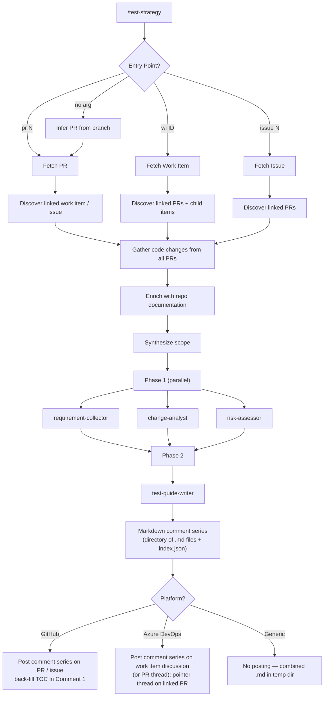

# Test Strategist Plugin

> Risk-based impact analysis and **manual-tester-focused** test strategy generation, posted as a logical series of Markdown comments on the PR / issue / work item.

Given a PR number, Azure DevOps work item ID, or GitHub issue number, this plugin resolves all linked context — requirements, code changes, child items, comments, and documentation — then posts a **business-readable Markdown comment series** on the pull request, issue, or work item discussion. Each comment is self-contained with a `[k/N]` header. The first comment carries a Table of Contents that deep-links to every other comment.

The series tells a manual tester two things:

1. **Where the highest business risk is** in this change.
2. **How to actually test it** — including ready-to-use, copy-pasteable test data.

Every test case is written in plain language. Each one carries a **"Why this matters"** business statement, a specific **user persona**, a **test data table** with realistic sample values (and boundary / negative / PII-flagged variations), step-by-step actions, the **expected business outcome**, and exactly where to verify it.

Reports are written for **manual QA testers, product owners, and non-technical stakeholders**. They never describe which line of code changed.

**No HTML file is produced and nothing is written to the repository working tree.**

---

## Quick Start

```
/test-strategy pr 87
/test-strategy wi 4521
/test-strategy issue 203
/test-strategy              # infers PR from current branch
```

### Flags

| Flag | Purpose |
|---|---|
| `--no-perf` | Skip performance test case generation |
| `--no-a11y` | Skip accessibility & usability test case generation |

```
/test-strategy pr 87 --no-perf --no-a11y
```

---

## How It Works



---

## Comment Series Structure

A typical run produces **5 to 8 comments**. Categories with no realistic surface (and categories suppressed by `--no-perf` / `--no-a11y`) are skipped — they do not get a comment.

| # | Comment Title | Always Present? | Contents |
|---|---|---|---|
| 1 | `[1/N] Overview & Focus Areas` | Yes | Header, headline business risk, **Where Testers Should Focus First**, test case count summary, linked PRs, **Table of Contents** (back-filled with comment URLs) |
| 2 | `[2/N] Risk & Impact` | Yes | Business Risk Assessment (overall + risk matrix + What Could Go Wrong), Impacted Areas, Code Changes Overview |
| 3 | `[3/N] Requirements & Gaps` | Yes | Requirements Coverage, Developer Changes Requiring Clarification, Missing Requirement Coverage, Context Gathered |
| 4..N-1 | `[k/N] Test Cases: <Category>` | Per non-empty category | One comment per category; each test case in `<details>` for scannability; size-split if a category exceeds ~50 KB |
| N | `[N/N] Coverage Map & QA Sign-off` | Yes | Coverage Map (req → TC, risk → TC, out-of-scope), Environment & Assignment, **QA Sign-off** as Markdown task list |

Each comment is kept under **50 KB** so it fits comfortably within both GitHub's (~64 KB) and Azure DevOps' (~150 KB) per-comment body limits. Long categories are split at a test-case boundary into `Part 1 of 2`, `Part 2 of 2`, etc.

---

## Entry Points

The command accepts three entry points. Only one is needed — the orchestrator resolves the rest automatically via bidirectional discovery.

| Entry Point | Example | What the agent does |
|---|---|---|
| **PR number** | `/test-strategy pr 87` | Fetches the PR diff, then discovers the linked work item or issue to read requirements |
| **Azure DevOps Bug or PBI ID** | `/test-strategy wi 4521` | Fetches the work item fields and comments, then discovers all linked and child PRs |
| **GitHub Issue number** | `/test-strategy issue 203` | Fetches the issue body and comments, then discovers all linked pull requests |
| **No argument** | `/test-strategy` | Infers the PR from the active branch |

---

## Agent Pipeline

### Phase 1 — Context Gathering (parallel)

| Agent | Focus |
|---|---|
| **requirement-collector** | Consolidates requirements: acceptance criteria (PBI/Feature), repro steps + root cause (Bug), child items, comments, referenced documentation |
| **change-analyst** | Translates each code change into user-visible behaviour ("what does the user notice?"); cross-references against requirements; flags "Developer Changes Requiring Clarification" with an actionable question for the developer |
| **risk-assessor** | Business-level risk summary plus a ranked **Top Focus Areas** list that drives the report's "Where Testers Should Focus First" section |

### Phase 2 — Comment Series Generation

| Agent | Focus |
|---|---|
| **test-guide-writer** | Produces a directory of Markdown files (one per planned comment) plus an `index.json` describing the comment series. Honours `--no-perf` and `--no-a11y` flags. Skips test case categories with no realistic surface. |

### Phase 3 — Posting

The orchestrator hands the working directory to the platform provider, which posts each comment in order, captures URLs, and back-fills the Table of Contents in Comment 1 with the captured URLs.

---

## Test Case Anatomy

Every test case is a self-contained set of instructions a manual tester can run without reading the code. Each one is rendered inside a `<details>` block (so the per-category comment stays scannable) and includes:

| Field | Purpose |
|---|---|
| **ID + title** | Sequential `TC-NNN` and a plain-language scenario starting with a verb the user performs |
| **Why this matters** | One or two sentences in a `> 💡 **Why this matters:**` blockquote. Business outcome verified if it passes; business loss if it fails; affected users |
| **Linked to** | The requirement (`AC` / `RS`) **and** the business risk (`Risk-N`) this case covers — no orphan test cases |
| **User role / persona** | The specific kind of user running the scenario |
| **Preconditions** | System state, environment, feature flags, existing data |
| **Test data** | A Markdown table of concrete copy-pasteable sample values, with boundary / PII / PCI / invalid flags in the Notes column |
| **Steps** | Numbered observable user actions — no code references |
| **Expected business outcome** | What the user sees and what the business gains |
| **How to verify** | Where the tester looks: UI cues, emails, records (technical hints permitted only here) |
| **If this fails** | What evidence to capture, which risk it confirms, who to escalate to |

---

## Test Data Generation

The plugin generates concrete, synthetic test data for every test case — the tester can copy and paste it. Generation covers:

- **Identifiers** — `*.test@example.com` / `Test-NNNN` patterns
- **Money / quantity** — currency-correct values around any thresholds (just below / at / just above)
- **Dates / times** — relative to "today", with edge dates (DST, leap day, far past / future) where relevant
- **Free-text** — short, long, with apostrophes ("O'Brien"), with non-ASCII (José, 王芳)
- **Geographic data** — postal codes, phone numbers in the system's actual format
- **Payment data** — known test cards (`4242 4242 4242 4242` for success, `4000 0000 0000 9995` for declined) — never real card numbers
- **Boundary values** — minimum, just below, maximum, just above, empty, whitespace, special characters, format-invalid (marked with `🎯 boundary`)
- **Negative test data** — expired coupons, blocked customers, oversized uploads, SQL/script-like strings, role-escalation attempts (marked with `⚠️ invalid`)
- **PII / PCI / PHI tags** — every sensitive field is flagged in the test data table (`🔒 PII`, `💳 PCI`, `🩺 PHI`)

Performance, accessibility, resilience, and compatibility test cases include category-specific extras (load profile, assistive technology, failure simulation, target browsers / OS / API versions).

---

## Test Case Categories

| Emoji | Category | When generated |
|---|---|---|
| 🟢 | **Functional** | Always |
| 🔵 | **Performance** | Change touches a service, query, or data pipeline (skipped with `--no-perf`) |
| 🔴 | **Security** | Change touches authentication, data input, API surfaces, or permissions |
| 🟡 | **Privacy & PII** | Change handles personal, financial, or health data |
| 🟣 | **Accessibility & Usability** | Change touches any user interface (skipped with `--no-a11y`) |
| ⚪ | **Resilience** | Change touches a service call, queue, or external dependency |
| 🟤 | **Compatibility** | Change touches a UI, public API, integration point, or shared contract |

Categories with no realistic surface are skipped automatically.

---

## Platform Support

The plugin auto-detects the hosting platform from the git remote URL:

| Remote URL contains | Platform | Fetch | Deliver |
|---|---|---|---|
| `github.com` | GitHub | `gh` CLI | Comment series posted on the issue or PR; TOC in Comment 1 deep-links to every other comment via `#issuecomment-` URLs |
| `dev.azure.com` / `visualstudio.com` | Azure DevOps | REST API | Comment series posted on the work item discussion (or on the PR thread if the entry was a PR with no linked work item); pointer thread posted on each linked PR |
| Anything else | Generic | Git + user input | No posting; comment files written to a temp directory plus a combined `impact-analysis-report.md` for offline reading — repository working tree stays clean |

---

## Rule Examples

### GitHub — PR

```
When using test-strategist on a GitHub repository and a PR number is provided,
you should /test-strategy pr 87

This will:
1. Fetch the PR diff and metadata via gh CLI
2. Discover linked issues from closingIssuesReferences and PR body
3. Fetch each linked issue's body, labels, and comments
4. Run the 4-agent pipeline
5. Generate the comment series in a temp directory
6. Post each comment in order on the PR, capturing URLs
7. Back-fill the Table of Contents in Comment 1 with the captured URLs
```

### GitHub — Issue

```
When using test-strategist on a GitHub repository and an issue number is provided,
you should /test-strategy issue 203

This will:
1. Fetch the issue body, labels, and comments via gh CLI
2. Discover linked PRs via timeline API and body search
3. Fetch diffs from each linked PR
4. Run the 4-agent pipeline
5. Generate the comment series in a temp directory
6. Post each comment in order on the issue, capturing URLs
7. Back-fill the Table of Contents in Comment 1 with the captured URLs
```

### Azure DevOps — PR

```
When using test-strategist on an Azure DevOps repository and a PR number is provided,
you should /test-strategy pr 42

This will:
1. Fetch the PR metadata and iterations via REST API
2. Discover linked work items from the PR
3. Fetch each work item with all fields, comments, and relations
4. Fetch child work items and changesets
5. Run the 4-agent pipeline
6. Generate the comment series in a temp directory
7. Post the series on the linked work item's discussion (or on the PR thread if no linked work item)
8. Back-fill the Table of Contents in Comment 1
9. Post a single pointer thread on the PR linking back to the work item discussion
```

### Azure DevOps — Work Item

```
When using test-strategist on an Azure DevOps repository and a work item ID is provided,
you should /test-strategy wi 4521

This will:
1. Fetch the work item with all fields, comments, and relations via REST API
2. Auto-detect Bug vs PBI/Feature and read appropriate fields
3. Discover all linked PRs and child work items
4. Fetch changesets attached to the work item
5. Run the 4-agent pipeline
6. Generate the comment series in a temp directory
7. Post the series on the work item discussion, capturing comment IDs
8. Back-fill the Table of Contents in Comment 1
9. Post a pointer thread on each linked PR linking back to the work item discussion
```

---

## Environment Variables

| Variable | Required | Platform | Purpose |
|---|---|---|---|
| `GITHUB-TOKEN` | If not using `gh auth login` | GitHub | GitHub API authentication |
| `AZURE-DEVOPS-TOKEN` | Yes | Azure DevOps | Personal Access Token for REST API |
| `AZURE_ORG` | No | Azure DevOps | Override org parsed from remote URL |
| `AZURE_PROJECT` | No | Azure DevOps | Override project parsed from remote URL |
| `AZURE_REPO` | No | Azure DevOps | Override repo parsed from remote URL |

### Token Permissions

**GitHub:**

| Permission | Access |
|---|---|
| Contents | Read |
| Metadata | Read |
| Issues | Read & Write |
| Pull requests | Read & Write |

**Azure DevOps:**

| Permission | Access |
|---|---|
| Work Items | Read & Write |
| Code | Read |
| Pull Requests | Read & Write |

---

## Prerequisites

- Must be run inside a git repository
- **GitHub**: `gh` CLI installed and authenticated (`gh auth login` or `GITHUB-TOKEN`)
- **Azure DevOps**: `AZURE-DEVOPS-TOKEN` environment variable set
- `jq` available on the `PATH` (used by all platform providers for JSON munging)

Verify prerequisites:

```bash
git --version           # required
jq --version            # required
gh auth status          # GitHub only
echo $AZURE-DEVOPS-TOKEN  # Azure DevOps only
```

---

## Plugin Structure

```
test-strategist/
├── .claude-plugin/
│   ├── plugin.json           # Plugin manifest
│   ├── .lsp.json             # Language server configs
│   └── settings.json         # Default agent setting
├── agents/
│   ├── orchestrator.md       # Main orchestrator — coordinates all agents
│   ├── requirement-collector.md  # Consolidates testable requirements
│   ├── change-analyst.md     # Analyzes code changes vs requirements
│   ├── risk-assessor.md      # Business-level risk assessment
│   └── test-guide-writer.md  # Produces the Markdown comment series + index.json
├── commands/
│   └── test-strategy.md      # /test-strategy command definition
├── docs/
│   └── platform-config.md    # Platform setup and token permissions
├── hooks/
│   ├── hooks.json            # Hook configuration
│   └── validate-prerequisites.sh  # Pre-run validation
├── providers/
│   ├── azure-devops.md       # Azure DevOps multi-comment posting flow
│   ├── generic.md            # Generic/fallback (combined .md in temp dir)
│   └── github.md             # GitHub multi-comment posting flow + TOC back-fill
├── skills/
│   ├── analyze-changes/SKILL.md
│   ├── assess-risk/SKILL.md
│   ├── collect-requirements/SKILL.md
│   ├── generate-test-strategy/SKILL.md
│   ├── post-strategy/SKILL.md
│   └── write-test-guide/SKILL.md
└── styles/
    ├── report-template.md    # Markdown comment-series template
    └── strategy.md           # Output style conventions (Markdown only)
```
